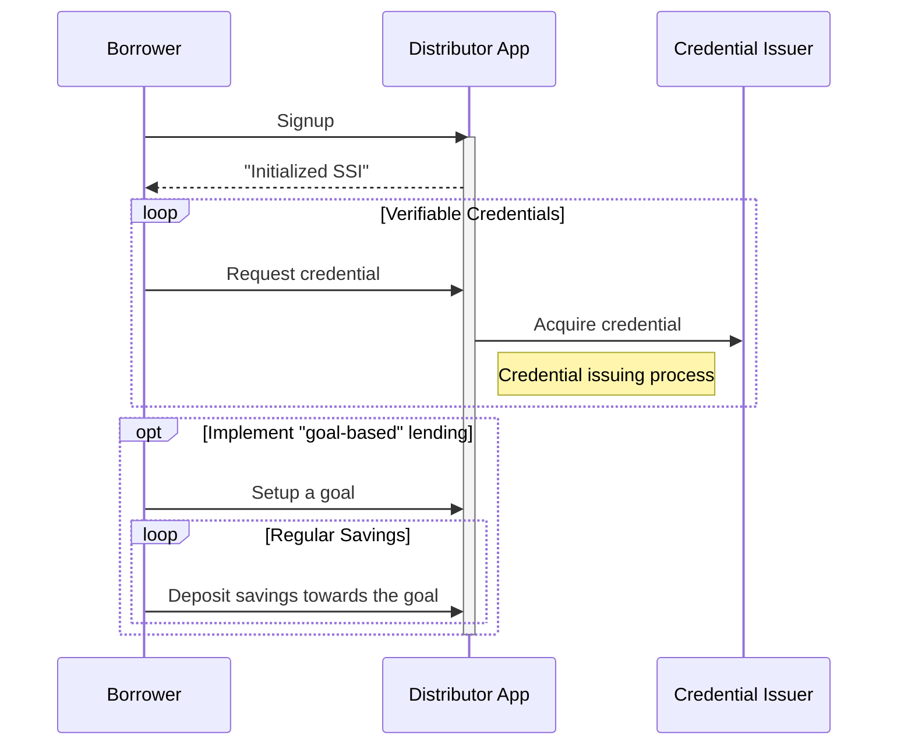

# Borrower Onboarding
## Custodial Model
In a custodial model, the borrowers onboard using a custodial mobile or web application in order to claim credentials and apply for a loan from the protocol.

Growr onboarding process requires several steps to be completed:
- The user must have SSFI (DID) address
- The user must collect one or more verifiable credentials and store them in his SSFI
The **self-sovereign financial identity (SSFI)** ensures a unique global digital identity of each user. For the SSFI implementaion, the protocol relies on W3C’s standards for Decentralized Identifiers (DID) The required verifiable credentials for loan application depends on the eligibility criteria of the each pond, to which the Borrower has intention to apply. For more details on verifiable credentials, check [Borrower Credentials](./C-Risk-Mgmt-2-Borrower-Credentials.md).  
To promote improving financial literacy and behaviors, Growr protocol encourages:
- **"Fnancial health treatment"**; that is, before applying for a loan, the user must go through education and mentoring program in order to collect credentials for positive financial health.
- **"Goal-based" lending**; that is, before applying for a loan, the user must create a goal related to his/her real-life need, and deposit regular savings towards it.
## Non-custodial Model
The non-custodial onboarding flow is almost the same. The main difference is that instead of Distributor App, the Borrower would use an agent app with connected self-managed wallet.