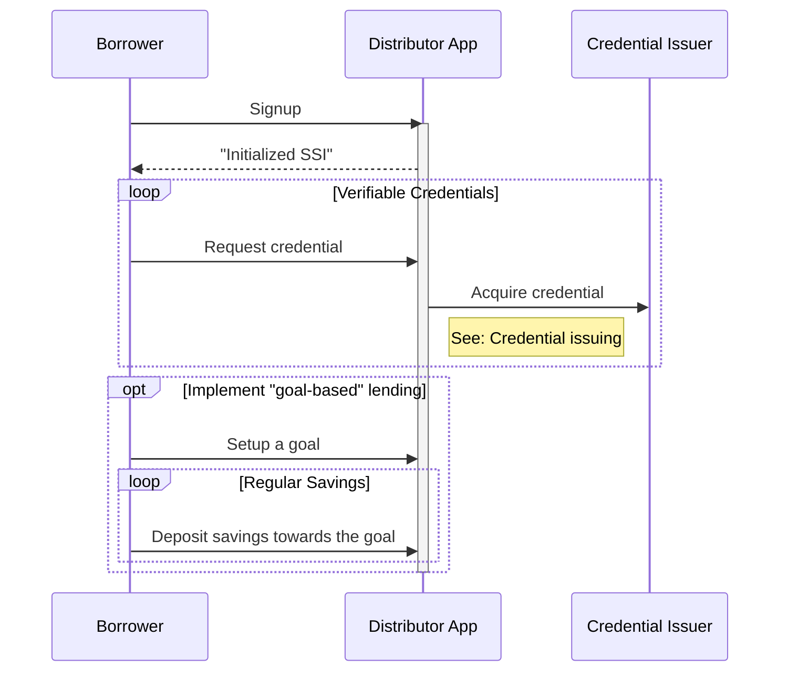

# Borrower Onboarding
The Growr protocol relies on a new type of decentralized identity that we call the **Self-sovereign Financial Identity (SSFI)**. It is intended to represent user's unique global identity and to store various verifiable credentials.
## Custodial Model
In a custodial model, the Borrowers onboard using a custodial mobile or web application in order to create their SSFI, claim credentials and apply for a loan from the protocol.

Growr onboarding process requires several steps to be completed:
- The user must have SSFI (DID) address
- The user must collect one or more verifiable credentials and store them in his SSFI  
The required verifiable credentials for loan application depends on the eligibility criteria of each pond, to which the Borrower has intention to apply. For more details, check [Credentials Issuing section](./B-Identity-2-Credentials-Issuing.md).  
To promote improving financial literacy and behaviors, Growr protocol encourages the implementation and use of the following key concepts:
- **"Learn and earn"**; that is, before applying for a loan, the user must go through education and mentoring program in order to collect credentials for financial health improvement.
- **"Goal-based" lending**; that is, before applying for a loan, the user must create a goal related to his/her real-life need, and deposit initial savings towards it.
- **"Savings discipline"**; that is, before applying for a loan, the user must create a saving habit by executing regular micro-payments to his saving account.
## Non-custodial Model
The non-custodial onboarding flow is almost the same. The main difference is that instead of Distributor App, the Borrower would create and self-manage its SSFI using an agent app.