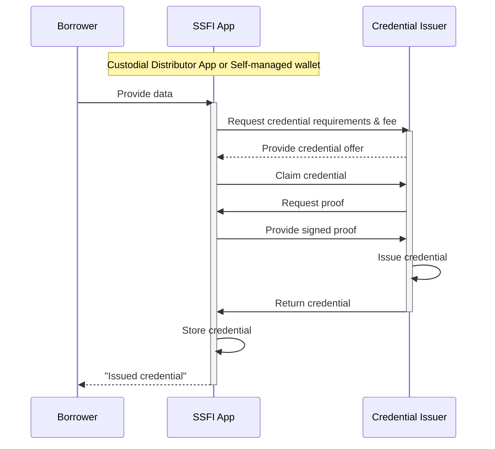

# Credentials Issuing
For the SSFI implementaion, Growr protocol relies on W3C’s standards for **Verifiable Credentials (VCs)**. Verifiable Credentials (VC) are provable claims associated with the SSFI address of the user. They are issued from different sources and are used to assert creditworthness in front of the lending ponds.
## Credentials Issuing
Credentials are provided by **Credential Issuers** – that is, centralized or decentralized third parties, asserting certain facts about the user.

Below is a standard process for credential issuing for Borrowers using a custodial SSFI App, managing Borrower' SSFI and storing his credentials. In non-custodial model, the process is the almost the same - instead of SSFI App, the user would use an agent app with connected self-managed wallet. The process follows the same pattern in the cases when credentials are issued to other protocol participants (eg. Lenders and Liquidity providers).

This issuing process could be part of an Onboarding process ([Borrower Onboarding section](./B-Identity-1-Onboarding.md)) or could be executed on-demand.

Several examples of verifiable credentials are presented in the sections below.
### KYC Credentials
In regulated custodial model, a verifiable credential for successfully passed KYC process (including AML/CFT risk check) is a must. Individual KYC credential can be requested from the Borrowers, when applying for a loan. In addition, institutional KYC credential could be requsted from Lenders, when trying to create or fund a lending pond, or from Liqudity Providers, when trying to create or fund a lending pool.

KYC Credential Issuer could be any traditional identity verification service or the Distributor itself.
### Credit Score Credential
Issuing of credit score credentials can simplify the loan application process, especially in a custodial model. Instead of defining a complex eligibility criteria for the pond that will require Borrowers to collect multiple credentials in their SSFI, the Lender might request only one "combined" credential representing the overall credit score of the Borrower. In addition, the credit score credential might determine the loan limit of the Borrower, as well as the applicable interest rate.

Credit Score Credential Issuer could be any risk scoring services, owned or accredited by a trusted Verifier.
### Financial Health Credential
The Growr protocol incentivizes good financial health and improving financial literacy and behaviors through gamification. Thus, the protocol encourages including the Financial Health credentials to every pond eligibility criteria; that is, before applying for a loan, the user must go through education and mentoring for "financial health treatment".

Financial Health Credential Issuer could be any educational service, voted as "trusted" by the protocol.
### Savings History Credential
The Growr protocol incentivizes good financial discipline and habits. With this regard, the protocol encourages including "savings history" credentials to every pond eligibility criteria; that is, before applying for a loan, the user must create a habit for regular micro-payments to his saving account.
  
Savings History Credential Issuer could be any financial institution (where the user has a saving account) or financial data processing service (to which the user provides account statement information), voted as "trusted" by the protocol.
### Social Vouching Credentials
Through social vouching, the Borrowers have the opportunity to create their personal networks. They can request and receive endorsement (in the form of Social Vouching credentials) from other users, and thus improve their creditworthness. We believe that endorsement and social affiliation will prove to be key instruments for reducing the cost of risk in decentralized lending environment.

Social Vouching Credential Issuer could be any risk rewiver, accredited by a trusted Verifier, or any protocol user with certain reputation level (rules to be decided and voted by the protocol community).
### Loan History Credentials
Growr protocol aims at incentivizing positive financial behavior. With this regards, regular on-time loan payments of past loans should help the Borrower build a positive on-chain credit score, which can be further translate to better loan conditions. This is achieved through the issuing of "loan history" credentials.
  
Loan History Credential Issuer is the Growr protocol itself. For more details, see [Loan History section](./C-Risk-Mgmt-7-Loan-History.md).
## Credentials Revocation
Issuers might need to revoke a certain credential before is expires - when the subject is no longer eligible for the credential or when they need to correct or update the information in the credential. In order to achieve this, they must implement the W3C's standard for Status List - during credential issuing they would embed in the credential a url to fetch the revocation list and the index in the list that corresponds to the given credential.
