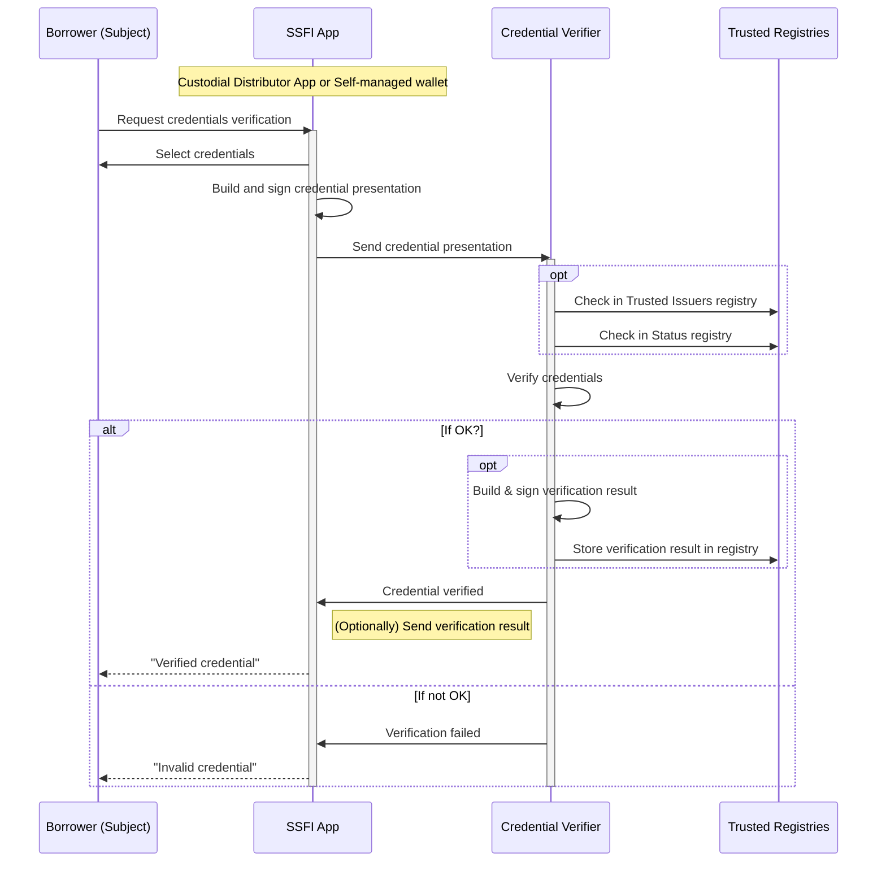

# Credentials Verification
Verifiable credentials are consumed by **Verifiers** using the concepts and data models for **presentation exchange**.   
Below is a standard process for credential verification using a custodial SSFI App to request the verification before applying for a loan. In non-custodial model, the process is the almost the same - instead of SSFI App, the user would use an agent app with connected self-managed wallet. The process follows the same pattern in the cases when credentials of other protocol participants (eg. Lenders and Liquidity providers) must be verified.  

The credential verification performed by the Verifier includes the following tasks:  
- Verify that the credential presentation is signed with the Subject's SSFI
- Verify that the credential is signed by a trusted Issuer
- Verify that the credential is not expired
- Verify that the credential is not revoked  
This verification process is part of the overall loan approval process. For more details, see [Loan Approval section](./C-Risk-Mgmt-3-Loan-Approval.md).
