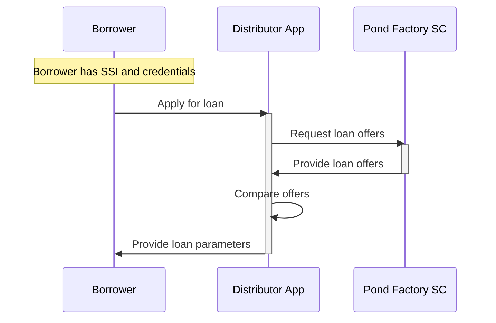
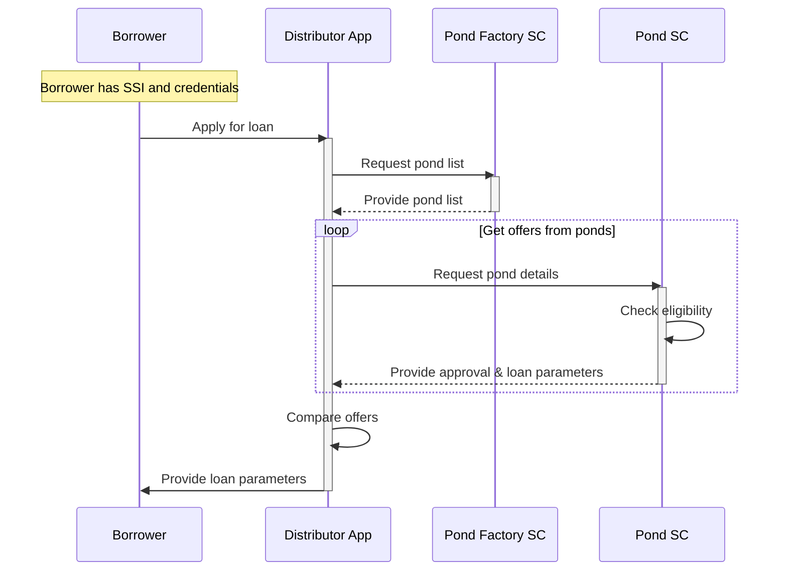

# Loan Offer
## Custodial Model
### Pond Factory holding pond details
TBD-description

TBD-description
### Pond Factory holding only pond addresses
TBD-description

TBD-description
## Non-Custodial Model
TBD-description