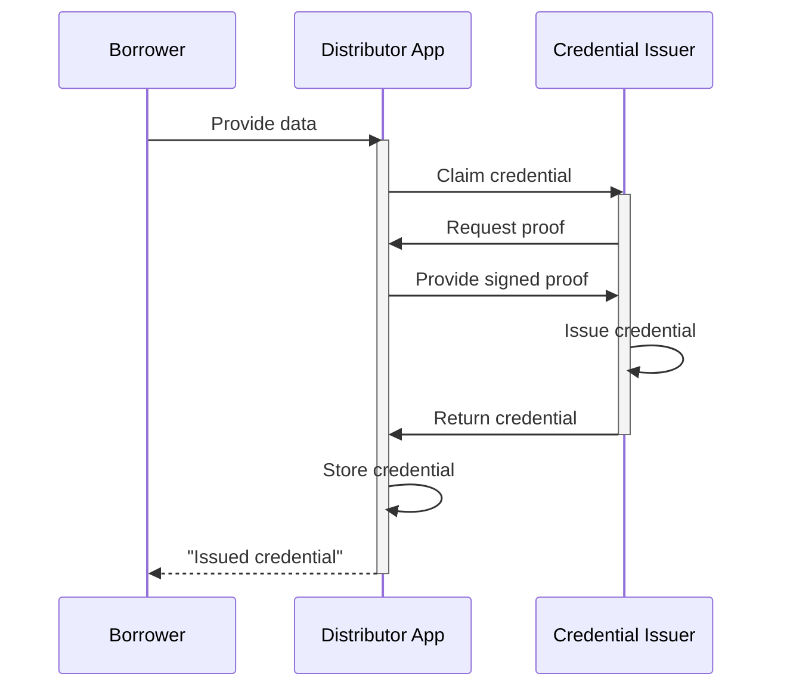

# Borrower Credentials
The Growr protocol relies on a new type of decentralized identity that we call the **Self-sovereign Financial Identity (SSFI)**. It stores a user's unique global identity and contains various **Verifiable Credentials (VCs)** - provable claims associated with the DID of the user. For the SSFI implementaion, the protocol relies on W3C’s standards for Verifiable Credentials (VC).  
The verifiable credentials are issued from different sources and are used to assert creditworthness in front of the lending ponds.  
## Credentials Issuing
Credentials are provided by **Credential Issuers** – that is, centralized or decentralized third parties, asserting certain facts about the user.  

Several examples of verifiable credentials are presented in the sections below.
### KYC Credentials
In regulated custodial model, a verifiable credential for successfully passed KYC process (including AML/CFT risk check) is a must. Individual KYC credential can be requested from the Borrowers, when applying for a loan. In addition, institutional KYC credential could be requsted from investors, when trying to create a pond or pool, or when trying to deposit funds in it.  
KYC Credential Issuer could be ... (TBD) 
### Credit Score Credential
TBD-description
Credit Score Credential Issuer could be any risk scoring services, owned or accredited by a trusted Verifier.
### Financial Health Credential
The Growr protocol incentivizes good financial health – that is, improving financial literacy and behaviors. Thus, the protocol encourages including the Financial Health credentials to every pond eligibility criteria; that is, before applying for a loan, the user must go through education and mentoring for "financial health treatment".  
Financial Health Credential Issuer could be any educational service, voted as "trusted" by the protocol.
### Social Vouching Credentials
Through social vouching, the Borrowers have the opportunity to create their personal networks. They can request and receive endorsement (in the form of Social Vouching credentials) from other users, and thus improve their creditworthness. We believe that endorsement and social affiliation will prove to be key instruments for reducing the cost of risk in decentralized lending environment.  
Social Vouching Credential Issuer could be any risk rewiver, accredited by a trusted Verifier, or any protocol user with certain reputation level (rules to be decided and voted by the protocol community).
### Loan History Credentials
Growr protocol aims at incentivizing positive borrowin behavior. With this regards, regular on-time loan payments of past loans should help the Borrower build a positive on-chain credit score, which can be further translated to better loan conditions. This is achieved through the issuing of "loan history" credentials.  
Loan History Credential Issuer is the Growr protocol itself. For more details, see [Loan disbursement section](./D-Loan-Payment-1-Disbursement.md) and [Loan repayment section](./D-Loan-Payment-2-Repayment.md).
## Credentials Verification
Verifiable credentials are consumed by **Verifiers** using the concepts and data models for **presentation exchange**.  
TBD-diagram
This verification process is part of the overall loan approval process. For more details, see [Loan Approval section](./C-Risk-Mgmt-3-Loan-Approval.md)
## Credentials Revocation
TBD-description
