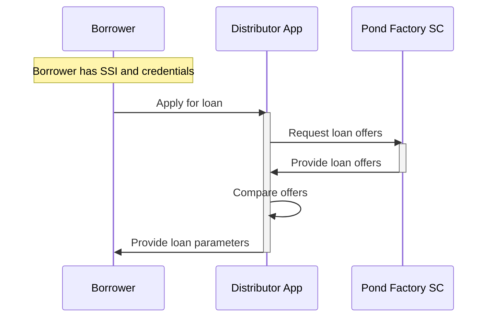
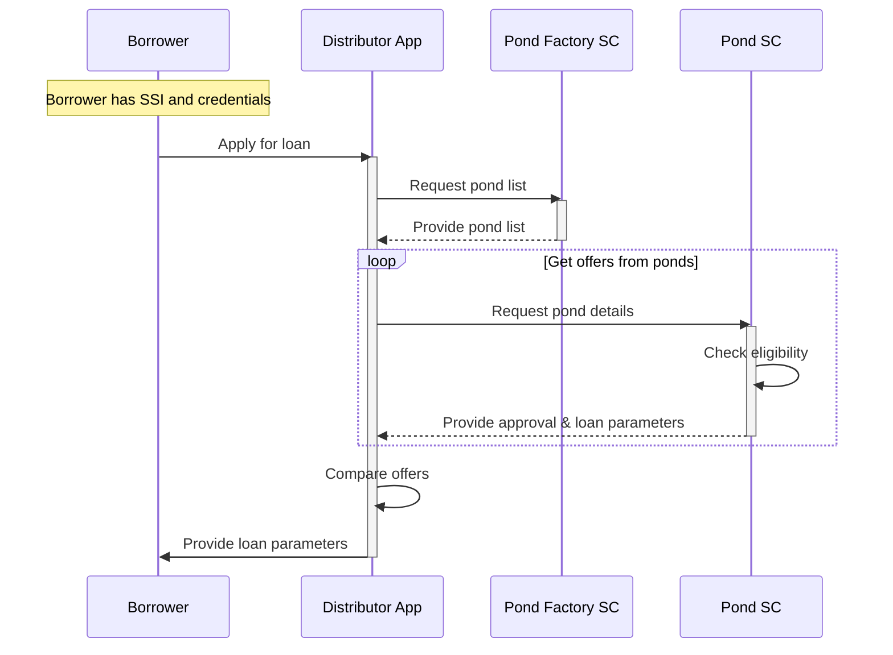

# Loan Offer
## Custodial Model
In a custodial model, the Borrowers requests a loan offer from the protocol using a custodial mobile or web application. There are 2 scenarios for loan offering, depending on the implementation of the Pond Factory smart contract.
### Pond Factory holding pond details
In this first scenario, the Pond Factory smart contract holds the details of all ponds created from its invocation requests.

### Pond Factory holding only pond addresses
In this second scenario, the Pond Factory smart contract holds only a list of addresses of the ponds created from its invocation requests and the Distributor App must "ask" for details each individual pond.

## Non-Custodial Model
The non-custodial loan offer flow is almost the same. The main difference is that instead of Distributor App, the borrower would use an agent app with connected self-managed wallet.
