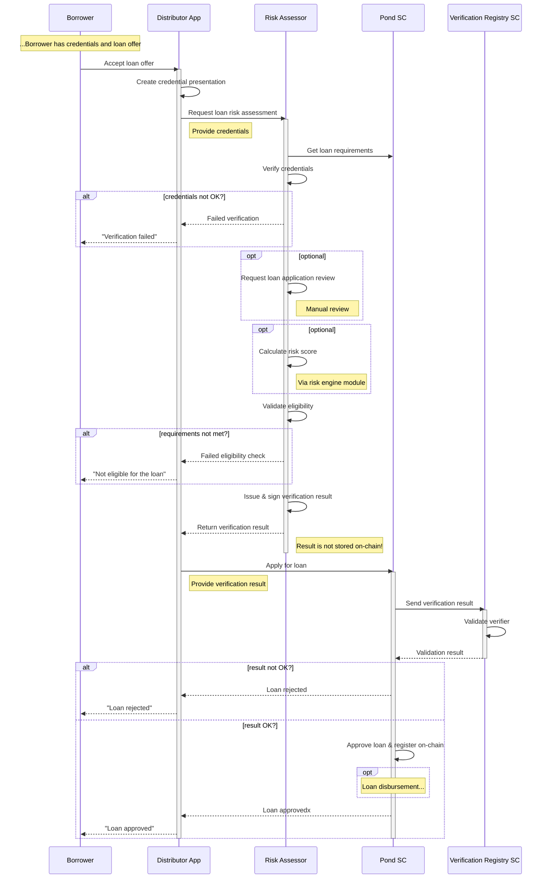

# Loan Approval
## Custodial Model
TBD-description

TBD - description  
Before approving the loan, the pond performs the following check:
- General pond check:
  * Pond is not stopped
  * There are available funds in the pond i.e. pond available funds > requested amount
- Loan request check - compare loan request parameters with smart contract's parameters:
  * User DID with verifiable credentials -> not empty
  * Requested loan amount -> between Min and Max amount; if outside of the range, the pond approves the nearest amount but does not reject the request
  * Request loan duration -> between Min and Max duration; if outside of the range, the pond approves the nearest amount but does not reject the request
- Eligibility check:
  * By providing the verification result to the Verification Registry smart contract  
Once the loan is approved, the smart contract registers it on the chain and returns a response with the following parameters:
- Approved amount
- Approved duration (in months)
- Interest rate (APR) %
- Disbursement fee %
- Cash-back rate %
- Interest amount ( = Amount x APR x Duration/12)
- Total amount to be repaid ( = Amount + Interest amount)
- Installment amount ( = Total amount / Duration)
## Non-Custodial Model
TBD-description
