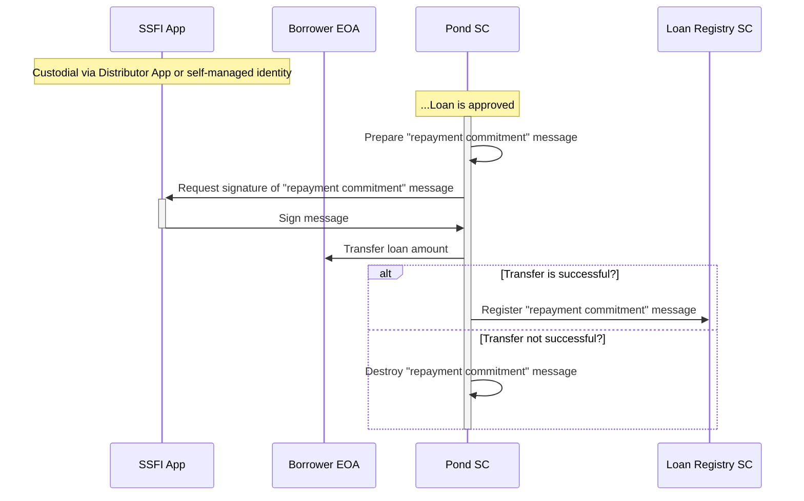
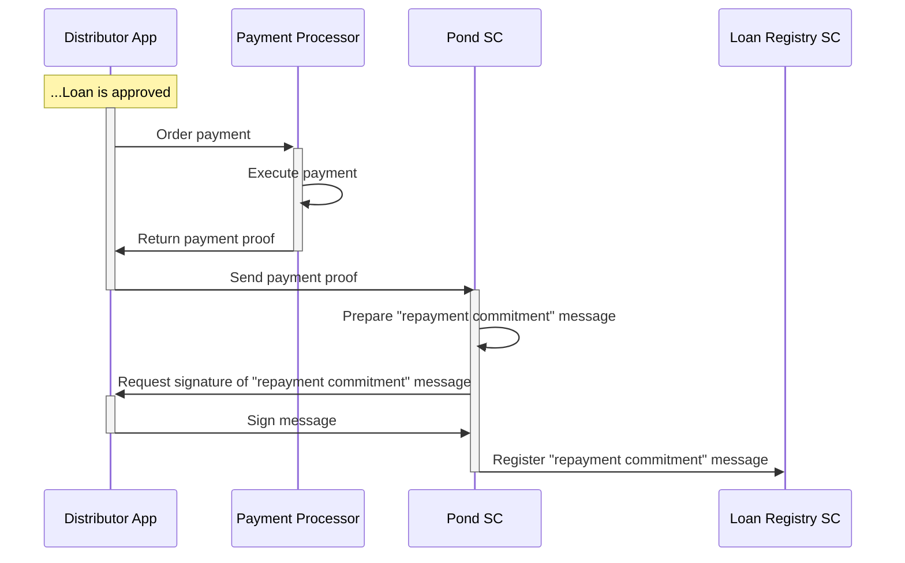

# Loan Disbursement
Disbursement of the loans occur immediately after a loan is approved and registered on-chain. There are two approaches for disbursement implementation - off-chain and on-chain. Both models are presented below.
## On-Chain Model
In this scenario, the disbursement transactions are executed on-chain by the Pond smart contract.

Loan disbursement is executed as a final step of the Loan Application process immediately after [Loan Approval](./C-Risk-Mgmt-3-Loan-Approval.md).
  
Before releasing the amount to the Borrower's account, the Pond smart contract creates a lightweight privacy-preserving message called **"repayment commitment"**. The message contains information about the Borrower's SSFI address, Loan Id and next installment date and amount. It represents a promise that the Borrower will make this payment. The messages is hashed and signed using Borrower's SSFI and then registered in the Loan Registry smart contract.
## Off-chain Custodian Model
In this scenario, the disbursement transactions are executed off-chain but the protocol receives "proof-of-pay" notifications about them.

Loan disbursement is initiated after the loan is approved and it occurs off-chain. The Pond smart contract receives a **"proof-of-pay"** receipt from the Distributor App and based on it the smart contrat prepares the repayment commitment message, requests signature on it and registers it.

