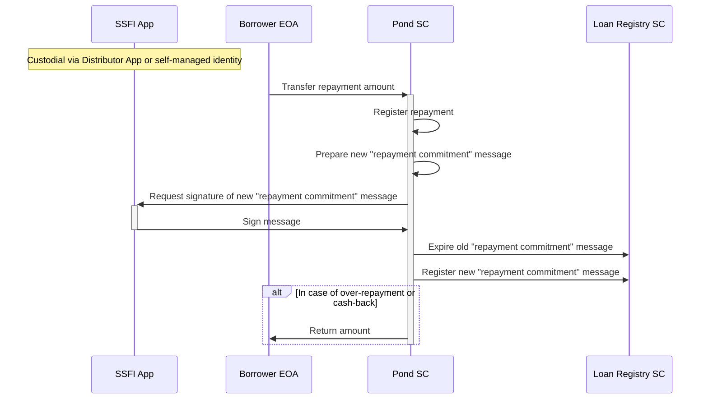
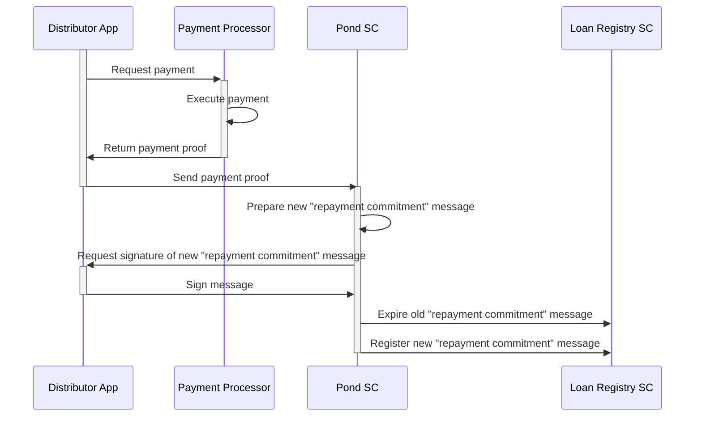

# Loan Repayment
Loans in Growr protocol are designed to be repaid on-chain through regular installments. Borrowers are allowed to repay an amount different than the regular installment amount.  
There a two approaches for repayment implementation - off-chain and on-chain. Both models are presented below.
## On-Chain Model
In this scenario, the repayment transactions are executed on-chain by the Pond smart contract.

After receiving the repayment amount, the Pond smart contract process the repayment:  
- If repaid amount = installment amount -> normal installment repayment
- If repaid amount < installment amount -> partial installment repayment
- If repaid amount > installment amount -> normal + partial installment repayment
- If repaid amount = remaining loan amount -> final loan repayment
- If repaid amount > remaining loan amount -> final loan repayment + amount for return  
After registering the event, the Pond smart contract creates a new "repayment commitment" message for the next installment. The messages is hashed and signed using Borrower's SSFI and then registered in the Loan Registry smart contract. The old "repayment commitment" message is marked as expired/invalid.  
In case the Borrower qualifies for a cash-back payment (i.e. all installments are repaid on time), the Pond smart contract repays back the amount to the Borrower. Alternatively, to promote a better financial discipline, this cash-back amount can be time-locked and use a verifiable credential in further loan applications.
## Off-chain Custodian Model
In this scenario, the repayment transactions are executed off-chain but the protocol receives "proof-of-pay" notifications about them.

Loan repayment is initiated and executed off-chain. The Pond smart contract receives a **"proof-of-pay"** receipt from the Distributor App and based on it the smart contrat prepares the repayment commitment message, requests signature on it and registers it.