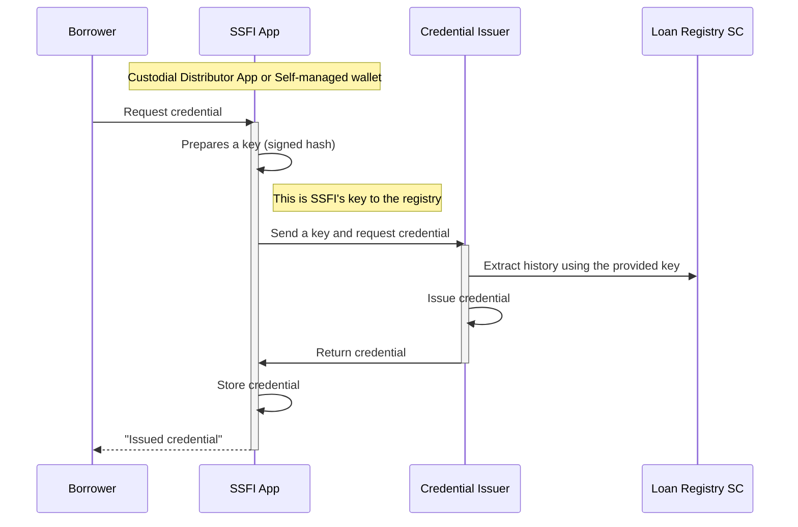

# Loan History
## Loan Registry
Loan Registry smart contract is responsible to keep track of the loan history. The registry represents a chain of crypted "repayment commitments" registered by the different Pond smart contracts. For more information on the events registration, see [Loan Disbursement](./C-Risk-Mgmt-4-Loan-Disbursement.md) and [Loan Repayment](./C-Risk-Mgmt-5-Loan-Repayment.md).  
How it works? Each "repayment commitment" record cointains information about the Borrower DID, Loan Id and next installment date and amount. When a Borrower repays an installment, the record is marked as expired/invalid and a new record is registered. When a Borrower fully repays a loan, the last record is invalidated but without a new commitment. Valid repayment commitment records with due date in the past will be indicators of overdue loans. Since all Pond smart contracts use the same Loan Registry, the latter can be used to determine the credit history of a given Borrower.  
The data stored in the Registry smart contract does not contain any personal data and is crypted in a way that only the owner of the SSFI key (the Borrower) can decrypt his/her credit history.
## Loan History Credentials
As a register of loan related events, the Loan Registry smart contract is able to provide a proof of the loan history of a given Borrower. The proof can be converted to a verifiable credential by a Credential Issuer and used by the Borrower in subsequent loan application.
