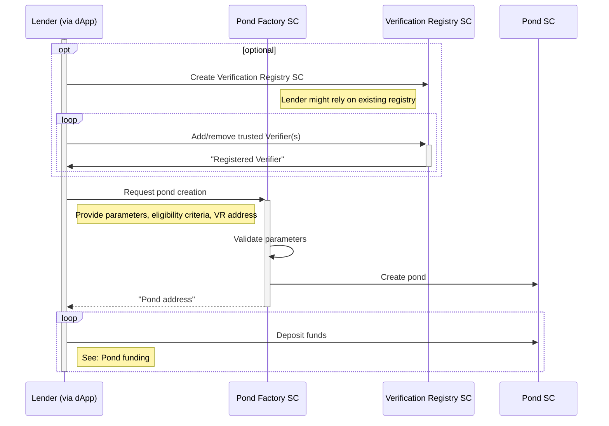

# Pond creation
## Off-chain Custodian Model
Below is a diagram that illustrates the steps for creation of a lending pond.

The parameters for pond creation includes:
- Owner
- Name
- Currency/Token
- Min & max loan amount
- Min & max loan duration
- Annual interest rate
- Disbursement fee
- Cash-back rate
- Strict eligibility criteria
- Reserve requirements
- Verification Registry address  
Once created, pond parameters cannot be changed. If the pond owner wants to modify certain parameters, they would create a new pond.  
An important parameter of every pond is the configured address of Verification Registry smart contract. The pond will rely on this smart contract to validate that the eligibility check was performed by a trusted Risk Assesor. Verification Registry contracts can be created either by pond owners (more risky) or by the protocol governance body (more secure).  
The protocol envisions a possibility for the owner to stop or pause the lending from a pond i.e. to permanently or temporary block future loan approvals from a pond.  
Pond funding in this model occurs entirely off-chain.
## On-chain Model
The pond creation in this scenario is the same as the custodial model. The only difference is that the pond funding occurs on-chain. Similar to depositing money into a deposit to receive a regular yield, pond creators sign a transaction and transfer funds from their RSK account to the respective lending pond, thus locking up their funds and providing liquidity to the protocol. We also foresee the possibility for pond creators to use custodial on-ramp services to directly deposit fiat funds from their accounts in traditional financial institutions to Growr protocol lending ponds.
