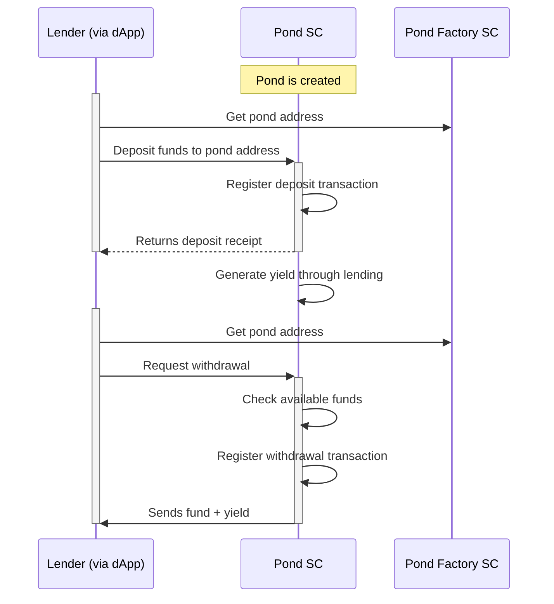
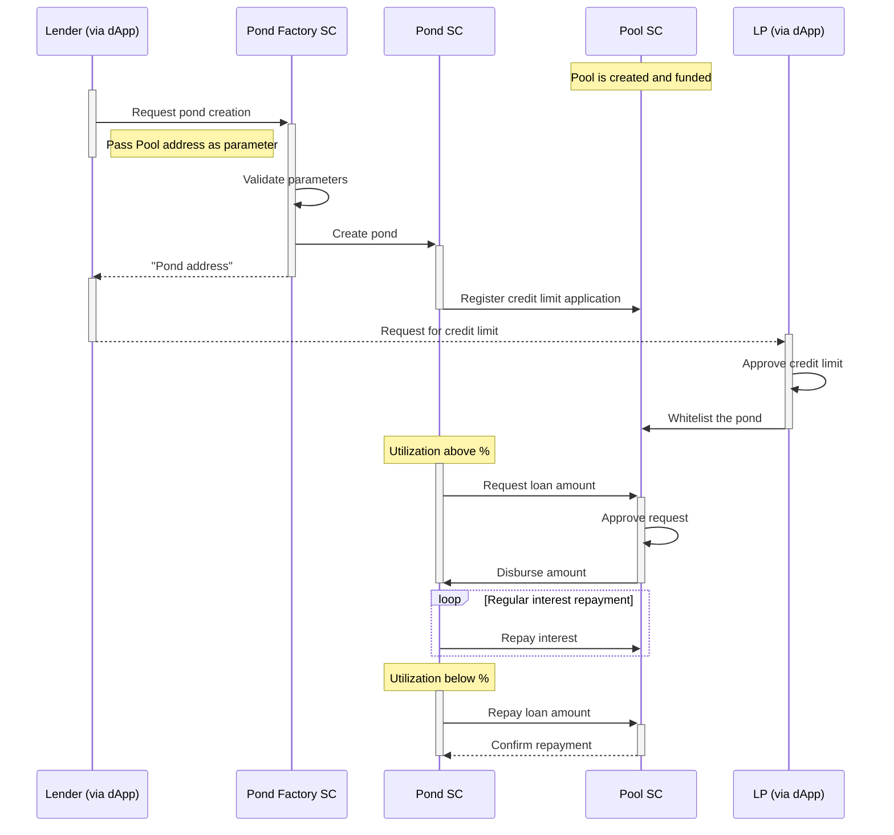

# Pond funding
The Growr protocol enables institutional investors to fund lending pools and ponds according to their risk/reward appetite. The protocol allows both funding models - custodial and non-custodial.
## Off-chain Custodian Model
The model with a Custodian has lower technology learning curve and protect the user funds from malicious actors. In this scenario, no matter whether the Lender uses own funds or applies to Liquidity Providers for funds, all transactions occur off-chain.
## On-chain Model
A pond can be funded in 2 ways – directly (independently) or by applying for funds from a global pool (with or without local self-participation). The sections below presents those 2 scenarios.
### Direct pond funding
Lenders, who has sufficient liquidity can also play the role of a Liquidity Provider and will fund its own pond, and also takes the entire generated yield.

### Pool-to-pond funding
The Growr protocol is able to operate on 2 levels – global pools and local ponds. Global pools are funded by institutional investors who then delegate the actual lending activity to local guilds with local lending ponds.  
A lending pool can be created by any institutional investor with enough capital (threshold to be defined by the protocol governance) who specifies the initial pool parameters. Investors can safely deposit funds into lending pools according to their preferences and based on automatic vetting using their own SSFI and verifiable credentials, e.g., applicable AML/CFT checks, required by the pool creator.

The flow for pool creation and funding is the same as the flow for pond creation and funding. For more details, visit [Pond Creation section](./D-Liquidity-1-Pond-Creation.md).

Local ponds then apply for funds from the pool resulting in so called "contract-to-contract (C2C) lending". Depending on the pond financing period, fund requirements, proposed risk model and eligibility criteria, the pool owner (Liquidity Provider) decides to approve or not the funding to the pond. This is how it works:

If a Lender considers using liquidity from a Pool, he configures the Pool's address during Pond creation so the newly created Pond smart contract automatically registers credit limit request on the Pool smart contract function.

The Pool owner (Liquidity Provider) can approve this request by whitelisting the Pond address in the Pool smart contract. At any time, the Pool owner can block or change this credit limit.

Based on the Pond utilization, the Pond smart contract can automatically apply to the Pool smart contract for a loan (up to the credit limit). The Pond is required to regularly repay the interest fee to the Pool. Depending on the configured utilization threshold, the Pond can repay partially or fully the loan to the Pool smart contract.
  
This process ensures automatic liquidity management between the Pool smart contract and the whitelisted Pond smart contracts.