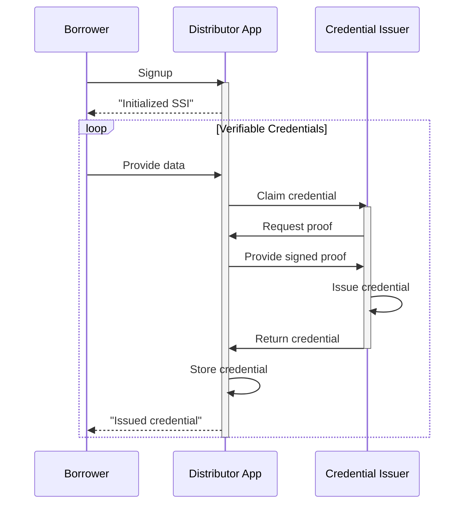

```mermaid
sequenceDiagram
    participant Borrower
    participant Distributor App
    participant Credential Issuer
    Borrower->>Distributor App: Signup
    activate Distributor App
    Distributor App-->>Borrower: "Initialized SSI"
    loop Verifiable Credentials
        Borrower->>Distributor App: Provide data
        Distributor App->>Credential Issuer: Claim credential
        activate Credential Issuer
        Credential Issuer->>Distributor App: Request proof
        Distributor App->>Credential Issuer: Provide signed proof
        Credential Issuer->>Credential Issuer: Issue credential
        Credential Issuer->>Distributor App: Return credential
        deactivate Credential Issuer
        Distributor App->>Distributor App: Store credential
        Distributor App-->>Borrower: "Issued credential"
    end
    deactivate Distributor App
```
