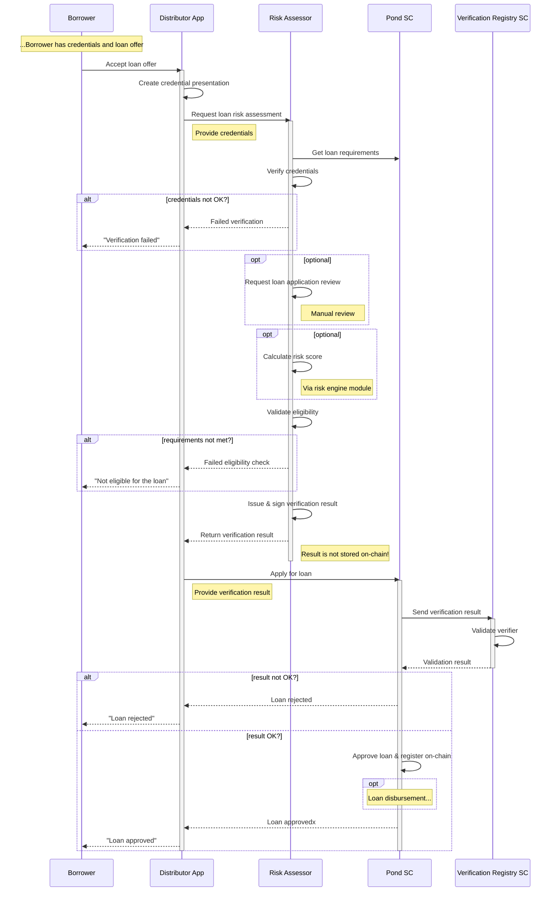

```mermaid
sequenceDiagram
    participant Borrower
    participant Distributor App
    participant Risk Assessor
    participant Pond SC
    participant Verification Registry SC
    Note over Borrower: ...Borrower has credentials and loan offer
    Borrower->>Distributor App: Accept loan offer
    activate Distributor App
    Distributor App->>Distributor App: Create credential presentation
    Distributor App->>Risk Assessor: Request loan risk assessment
    activate Risk Assessor
    Note right of Distributor App: Provide credentials
    Risk Assessor->>Pond SC: Get loan requirements
    Risk Assessor->>Risk Assessor: Verify credentials
    alt credentials not OK?
        Risk Assessor-->>Distributor App: Failed verification
        Distributor App-->>Borrower: "Verification failed"
    end
    opt optional
        Risk Assessor->>Risk Assessor: Request loan application review
        Note right of Risk Assessor: Manual review
    end
    opt optional
        Risk Assessor->>Risk Assessor: Calculate risk score
        Note right of Risk Assessor: Via risk engine module
    end
    Risk Assessor->>Risk Assessor: Validate eligibility
    alt requirements not met?
        Risk Assessor-->>Distributor App: Failed eligibility check
        Distributor App-->>Borrower: "Not eligible for the loan"
    end
    Risk Assessor->>Risk Assessor: Issue & sign verification result
    Risk Assessor-->>Distributor App: Return verification result
    Note right of Risk Assessor: Result is not stored on-chain!
    deactivate Risk Assessor
    Distributor App->>Pond SC: Apply for loan
    activate Pond SC
    Note right of Distributor App: Provide verification result
    Pond SC->>Verification Registry SC: Send verification result
    activate Verification Registry SC
    Verification Registry SC->>Verification Registry SC: Validate verifier
    Verification Registry SC-->>Pond SC: Validation result
    deactivate Verification Registry SC
    alt result not OK?
        Pond SC-->>Distributor App: Loan rejected
        Distributor App-->>Borrower: "Loan rejected"
    else result OK?
        Pond SC->>Pond SC: Approve loan & register on-chain
        opt
            Note over Pond SC: Loan disbursement...
        end
        Pond SC-->>Distributor App: Loan approvedx
        Distributor App-->>Borrower: "Loan approved"
    end
    deactivate Pond SC
    deactivate Distributor App
```