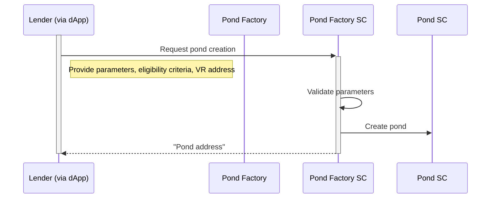

# Welcome to Growr!

# Introduction

       
            
- [{{ doc.name }}]({{ site.baseurl }}{{ doc.url }})
            
        

# How it works

       
            
- [{{ doc.name }}]({{ site.baseurl }}{{ doc.url }})
            
        

# Architecture

       
            
- [{{ doc.name }}]({{ site.baseurl }}{{ doc.url }})
            
        

