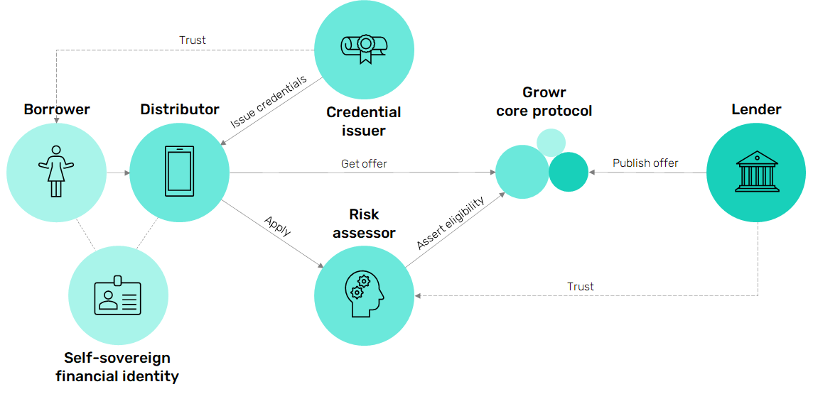

# Protocol Overview

## Problem
Financial health is an important factor in our daily life. However, bad financial health is plaguing the world. More than half of the global population is living paycheck-to-paycheck without any savings [(link)](https://globalfindex.worldbank.org/sites/globalfindex/files/chapters/2017%20Findex%20full%20report_chapter5.pdf). In addition, almost 2 billion adults in the world do not have access to financial services [(link)](https://ufa.worldbank.org/en/ufa) or if they do, they  fall prey to financial sharks and receive loans at a very high interest rate. Moreover, there are still 72 countries where women from specific social groups do not have the right to open a bank account or obtain credit [(link)](https://www3.weforum.org/docs/WEF_GGGR_2020.pdf).

At the same time, even people who have savings in cash or in a bank account are also impacted. On the one hand, macroeconomic events, such as high inflation, are literally “eating their money” and on the other hand, they are not able to acknowledge the disruptive change that is happening to the financial system.

Today, most financial service providers do not solve those problems. They are clueless about people's real-life problems, needs and aspirations. There's a complete disconnect between the person and the provider. Banks, and even more so non-banking lenders, have a negative image especially with younger generation, who, as a result, are more likely to go to the dentist than visit a bank.

## Solution
We propose the **Growr protocol** as a bridge to a new global financial environment. The Growr protocol combines instant unsecured loans, innovative credit assessment models, decentralized identity and financial health incentivization.

To addresses the problems stated above, the protocol implements at its core the following concepts:
1. **Borrowers** collect credentials based on alternative data into their own self-sovereign financial record. This provides even unbanked and traditionally excluded population with access to loans with fair conditions.
2. **Lenders** use these borrowers' credentials to better assess creditworthiness. They are able to apply flexible local risk policies such as social vouching or savings discipline.
3. **Trusted parties** (financial providers, merchants, employers, NGOs) are incentivized to provide credentials for the borrowers.
4. **Global investors** provide funds to a global marketplace to generate yield on excess capital. They receive flexibility in defining their risk/reward preferences and end-to-end transparency in their capital allocation.

Below is a high-level overview of Growr protocol:

The key components of the protocol are: 
- **Growr core protocol** – a decentralized smart contract ecosystem for funding and consuming loans on top of blockchain, with open access for everyone.
- **Self-sovereign financial identity (SSFI)** – a digital identity, based on W3C's DID and VC standards, owned and managed by the user, and storing their credentials.
- **Web and mobile applications for protocol access** (often provided by Distributors) - a simple and secure way for borrowers to easily apply and obtain fair loans.
- **Credit risk assessment** – a framework for establishing trust including issuing of verifiable credentials, presenting those credentials to risk assessors for verification, and creation of verification record that asserts the borrower's eligibility.
- **Growr DAO** - a future decentralized autonomous organization for protocol governance and fair compensation of trusted protocol contributors.
  

