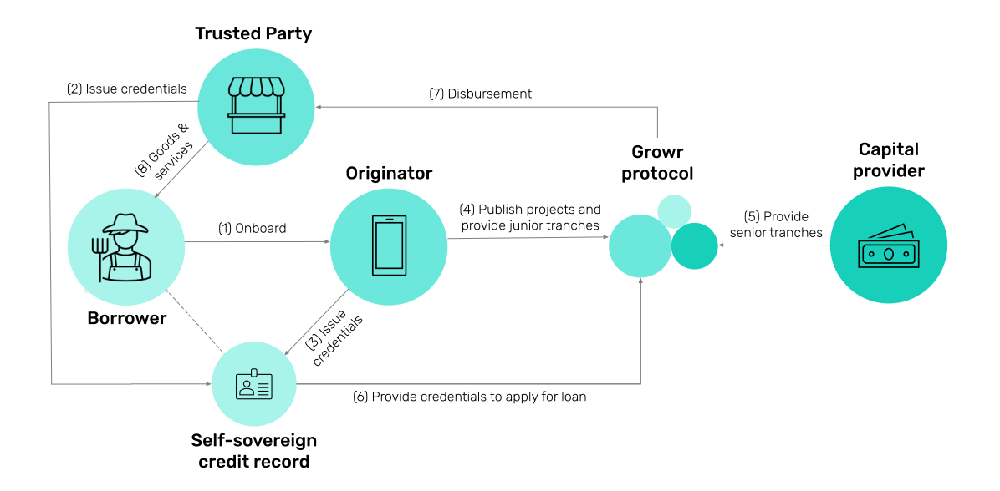

# Protocol Mechanics

## How it works
Below is a high-level overview of Growr protocol:

How Growr works?
- (1) Local distributors (such as cooperatives, guilds, wholesale buyers or even MFIs) create credit line applications with details about their local activities and their financing needs. The distributors could also provide a partial collateral as a first-loss capital to cover potential losses from bad debtors.
- (2) Risk Assessors, working for a lender or provided by a third-party, review each credit line application, to assess the risk and provide a credit rating.
- (3) The lender (traditional financial institution or a fintech) approve the credit line if it fulfils the risk policy. Upon approval, the Lender creates and setups a lending pond in the loan marketplace with a predefined eligibility criteria.
- (4) Global liquidity providers can approve additional funding to the lending pond, fully delegating the actual lending activity to the lender and the protocol.
- (5) To enable the local community to access the loan marketplace, the distributor provides a borrowing application to its trusted community members. After quick onboarding, the borrowers must receive the required verifiable credentials in their financial record - either from the distributor or from other third parties (financial providers, merchants, wholesalers, employers, NGOs).
- (6) Borrowers go through a simple application process to receive the loan from the credit line after asserting their eligibility with the verifiable credentials. The disbursed amount is received by the borrowers in the borrowing application, where they can make a direct payment to a merchant or use it in another way to achieve their goals.

The Growr protocol aims at standardization of the protocol mechanics. However, depending on the protocol participants and the tools and services they use, implementation details might vary. In general, we can distinguish the following use case specifics.
- Protocol access: Custodial vs Non-custodial borrowing application
- Liquidity: Separate Lender and Liquidity provider vs Lender providing the liquidity
- Distribution: Separate Lender and Distributor vs Lender covering the distribution process
- Loan payments: On-chain vs Off-chain

## Protocol Participants

### Borrowers
**Borrowers** get easy access to fair loans. They apply for funds from a loan marketplace and then repay the funds with added interest and/or fees. Borrowers gradually receive better conditions for positive financial behavior. They can receive “cash back”-style rewards based on their improved financial health (i.e., regular loan repayment and proof of financial learning), as well as for referral of other well-behaved Borrowers.

Borrowers can access the protocol via a Distributor in custodial model or via a decentralized App in non-custodial model.

### Distributors
**Distributors**, or also called **Last-mile Providers**, intermediates access to the protocol to a specific group of Borrowers in a custodial model with a simple UX. Distributors can be local communities and cooperatives, employers, merchants, or regulated financial institutions/fintechs. The role of the Distributor is to onboard and vet the users into its own digital means (e.g, a mobile application) and then facilitate access to the protocol. Financial institutions can combine the role of a Lender and a Distributor.

Some Distributors could be also **Guarantors** providing first-loss capital and cover for missing credentials certain specific borrower groups (e.g., women, employees, unemployed, community members, etc). Guarantors deposit funds into a Safety Fund, from which certain ponds can claim money in case of payment incidents.

### Lenders
**Lenders** publish offers to the loan marketplace as they create and fund ponds using own funds or by borrowing from global pools. Lenders can be financial service providers (regulated lenders) or local communities (informal lenders). They receive yield based on the pond profitability, and the pond yield tend to be higher than the pool yield, rewarding the skin-in-the-game participation of the Lender. Some Lenders might fully cover the role of a Liquidity Provider.

### Liquidity Providers
**Liquidity Providers (LPs)** are global investors or DeFi pools who provide funding and then delegate the actual lending activity to the Lenders. Liquidity Providers allocate capital to lending pools and get rewarded with yield based on the pool profitability. Generally, the global pool yield will tend to be lower that the pond yield due to the wholesale lending nature of the pools.

### Credential Issuers
**Credential Issuers** serves an important risk management role in the protocol. They are centralized or decentralized third parties (financial providers, local cooperatives and communities, merchants, employers, NGOs) that provide **verifiable credentials** to borrowers to assert facts about them. Credential Issuers receive a fee for the credentials they are issuing.

### Risk Assessors
Credit risk assessment is a crucial component of the Growr protocol and the **Risk Assessor** is a key participant. They review applications for new credit lines, assess the proposed loan parameters, price (rate and fees) and eligibility criteria, and calculate a credit rating. The Risk Assessor is rewarded with a fee according to its usage. The Risk Assessor could be "owned" by Lenders or Liquidity Providers to ensure they can manage their own policies, or could be provided by the protocol or trusted third parties.

### Other Risk Assessment roles

#### Credential Verifier
Credential Verifiers consume credential presentations and verify that the credentials are valid i.e. the credentials are issued from trusted Issuer, they not expired and not revoked. This role is usually covered by the protocol but some Lenders might integrate their own verification service.

#### Credit Risk Scorer
In case of a more sophisticated pond eligibility requirements, Lenders might integrate a module for additional credit assessment/scoring techniques, including scorecards, ML models, and others. The result of this additional assessment is a credit score, which is then matched with the pond's credit score requirements. The Credit Risk Scorer could also participate in the protocol as a standalone Credential Issuer and issue a credential with the calculated score. 

#### Credit Risk Reviewer
Risk Reviewers are employed by a Risk Assessor (or the protocol itself) to review a loan application and interview the Borrower in order to generate additional confirmation or vouching credentials used to endorse her/him. The Credit Risk Reviewers could also participate in the protocol as a standalone Credential Issuer and issue a credential with the calculated score.

### Payment Processors
**Payment Processors** facilitates the payment processes in the protocol by providing different off-chain payment services. On the one side, they can provide on-ramp and off-ramp services, and on the other side, they facilitate and settle fiat payments between Borrowers and Lenders, and between Lenders and Liquidity Providers.

### Growr Protocol
The Growr protocol and its components are supposed to cover the following functions:
- Loan Marketplace: Growr provides infrastructure and tools and for decentralized loan management.
- Integrations: Growr provides integration with Lenders' systems for credit line management, integrations with Liquidity Providers' systems for liquidity management, and integration with Payment Processors' systems.
- Protocol Access: Growr provides web and mobile applications to access the protocol.
- Credential Verification: Growr provides credential verification service asserting that a given Borrower matches the eligibility criteria of a given pond.
- Risk Assessment: Growr provides credit line assessment service.
- Governance Board for protocol monitoring, changes implementation and fraud prevention.
