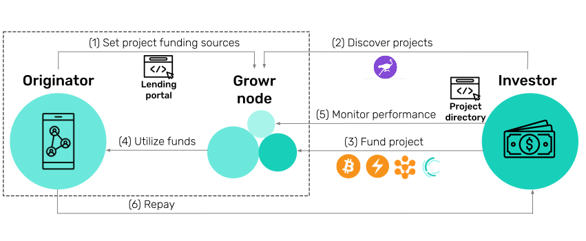

# Protocol mechanics

## How it works

The following diagram provides a high-level overview of Growr protocol.

Originators manage the “last-mile” processes through their Growr node. They help community members to build their self-sovereign credit record and facilitate the access to the protocol services & project funding for them.

Capital providers fund projects either by accessing the Growr node of an originator directly, or by running their own node and using the protocol discoverability features. The P2P data exchange enables real-time reporting of the project portfolio for full transparency.

## Lending

The diagram below presents a summary of the lending processes.

1. The _borrower_ is onboarded on a platform, provided by an _originator_ (such as a cooperative, guild, wholesale buyer, digital wallet, or another provider), where the borrower defines their funding needs.
2. One or more _trusted parties_, such as merchants of suppliers, provide credentials to the _borrower_ to start building their self-sovereign credit record.
3. The _originator_ creates a loan offer in the form of a project with details about the local activities and the financing needs of the _borrowers_.
4. _Borrowers_ go through a simple application process to receive a loan after asserting their eligibility with their verifiable credentials.
5. The disbursed amount is received by the _borrowers_ in the borrowing application or directly paid to a _third party_, such as a merchant or a supplier.
6. The _third party_ provides the necessary goods and services to the _borrower_ to achieve their goals.
7. Depending on their business activity and the agreed lending conditions, the _borrowers_ repay their loans on a regular basis or as a bullet payment at the end of the season.

## Funding

The diagram below presents a summary of the funding processes.

1. While creating the loan offer, the _originator_ defines the project funding terms and available payment rails.
2. A _capital provider_ reviews the projects with their predefined eligibility criteria and funding parameters, assesses the risk and confirms his investment intent.
3. The _capital provider_ deploys funding to the project as a senior tranche via any of the possible payment rails.
4. The _originator_ utilizes the provided capital and performs the actual lending activity to the _borrowers_.
5. The _capital provider_ monitors the performance of their investment through Growr protocol that provides reporting of real-time events and full transparency into how the capital is deployed into borrower subscriptions.
6. According to the agreed funding terms, the _originator_ repays back the senior tranche plus the generated yield.

## Protocol participants

### Borrowers

_Borrowers_, represented by self-employed, micro-businesses, and smallholder farmers, apply for productive loans from the marketplace, most often with the help of a local originator, and then repay the loan plus its price.

### Originators

_Originators_ facilitate access to the protocol by grouping several borrowers with similar needs and presenting project applications to the marketplace on their behalf. They publish offers to the loan marketplace by creating _projects_ on behalf of the borrowers. The originators provide junior (first-loss) capital to finance the whole project or part of it. They can be:

- _Local cooperatives, guilds or other community organizations_ that are formed by borrowers to gain better access to loans and to standardize their relationship with the rest of the participants in the ecosystem.
- _Bitcoin circular economies_ using solutions such as Federated Chaumian mints [[20]](#ref20), enabling access to micro-financing to their users.
- _Telcos, retailers and gig-economy platforms_ that onboard and vet the users into their services and then facilitate their access to the protocol as an embedded financial service.
- _Digital wallets and fintech providers_ that already offer financial services and that can expand to unsecured decentralized lending.

### Trusted parties

_Trusted parties_ assert facts about the borrowers in the form of verifiable credentials. They can be:

- The _originator_, issuing credentials for its members or users.
- _Merchants, buyers, unions, chambers or other local organizations_ that serve the community or have knowledge of their members.
- _Independent third-party data providers_ that can issue credentials related to the activity of the borrower and relevant to the risk assessment process, such as KYC/AML, account data, and on-chain activity.
- _Financial health providers_ that publish educational materials and tools to help borrowers develop good financial habits and issue credentials that assert knowledge, skills, and accomplishments.

### Capital providers

_Capital providers_ allocate senior capital to the loan marketplace and delegate the actual lending activity to the originators in the form of senior tranches for the financed projects. They can be:

- Individual bitcoin investors.
- Large institutional investors or digital asset managers.
- Decentralized finance protocols.

### Growr protocol

_Growr protocol_ implements a global decentralized micro-lending marketplace as a P2P network of Growr nodes. Each _Growr node_ represents a package of open-source components and a set of lending projects. It enables originators to publish projects with predefined conditions and eligibility criteria, and borrowers to apply and get financing using credentials from their self-sovereign credit record. It also enables capital providers to fund projects either by accessing the Growr node of an originator directly, or by running their own node.

## Participant incentives

<table>
  <tr>
   <td><strong>Role</strong>
   </td>
   <td><strong>Tangible incentives</strong>
   </td>
   <td><strong>Intangible incentives</strong>
   </td>
  </tr>
  <tr>
   <td><strong>Borrower</strong>
   </td>
   <td>Access to productive capital at a fair price. Optional “cash-back”-like rewards paid by the originator for positive behavior (e.g., on-time repayment). Opportunity to start saving in bitcoin (optional).
   </td>
   <td>Build their self-sovereign credit record with the ability to use it for future financing needs.
   </td>
  </tr>
  <tr>
   <td><strong>Trusted party</strong>
   </td>
   <td>One-time fee paid by the borrower upon VC issuing (optional). Financial health rewards paid by the originator after on-time loan repayment (optional).
   </td>
   <td>Success and growth of the community.
   </td>
  </tr>
  <tr>
   <td><strong>Originator</strong>
   </td>
   <td>Origination fee upon each loan disbursement. Interest margin (yield) from the borrowers. Access to global capital without intermediaries.
   </td>
   <td>Success and growth of the community. Revenue growth for service providers. Access to more customers in the marketplace.
   </td>
  </tr>
  <tr>
   <td><strong>Capital provider</strong>
   </td>
   <td>Real-world yield on the invested capital. Return on digital assets without selling them.
   </td>
   <td>End-to-end transparency for the investments without intermediary counterparty risk. Bringing impact to local communities.
   </td>
  </tr>
  <tr>
   <td><strong>Growr node</strong>
   </td>
   <td>Protocol fee for loan management infrastructure. Capital routing and exchange fees (optional).
   </td>
   <td>
   </td>
  </tr>
</table>

