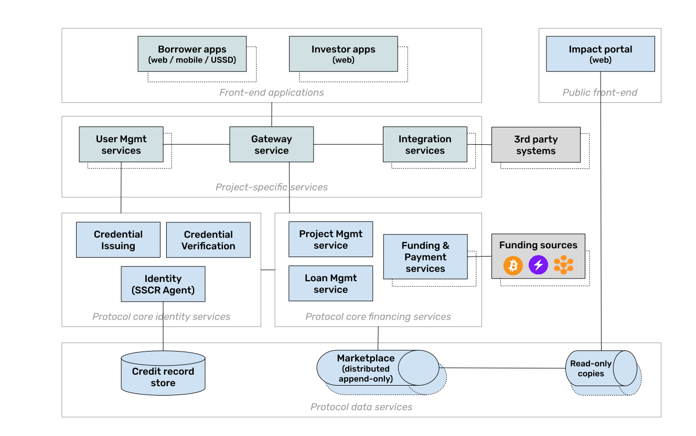

# Protocol architecture

## Overview

The following diagram provides a high-level overview of Growr functional architecture.

_Growr protocol_ implements a global decentralized micro-lending marketplace as a P2P network of Growr nodes. Each _Growr node_ represents a package of open-source components and a set of lending projects. It enables originators to publish projects with predefined conditions and eligibility criteria, and borrowers to apply and get financing using credentials from their self-sovereign credit record. It also enables capital providers to fund projects either by accessing the Growr node of an originator directly, or by running their own node.

Growr architecture provides the opportunity to pack the applications and services in few options, based on the deployment requirements and specifics. There are several deployment blueprints for Growr node depending on the use cases, for example: self-hosted originator node, cloud-hosted originator node or cloud-hosted investor node. The backend services can be packed as a single docker image and can be included in different configurations to run all or few services per deployment target.

The Growr nodes communicates between each other in 2 ways. The first option is through a Discovery service, using the TCP Gossip transport protocol. The second option is through replication of the distributed data across the network, using Holepunch's Hyperbee and Hyperswarm protocols.

## Front-end applications

At the top of the diagram are the front-facing applications. These apps and services are on top of FOSS protocol and services. They can be developed by Growr or other integrators per deployment. The node can be extended with different applications fitting the purpose.

- _Borrowing and Community front apps:_ Set of applications that are used by the borrowers to operate their self-sovereign credit record and to apply for funding from different projects. Depending on the local environment and user base, those might be web, mobile or USSD applications.
- _Lending and Investor apps:_ Applications used by originators and investors to create and fund projects, and to monitor their performance.
- _Impact portal:_ An open-source standalone web application that can use aggregated data from the protocol to display a dashboard presenting the global impact of the marketplace.

The front-facing applications are connected to Growr node via an API layer, which is responsible for the authentication and authorisation of the users, as well as for the communication with the core services of the protocol.

## Growr core services

The backend of Growr node consists of a group of services that are maintained as open-source software under an open license but can be extended following the community and product guidelines. All the services in these groups are deployed with proof that the running service has a well-known identity or a public key, and its code is identical to the source code in the Growr repositories.

### Identity services

The Growr protocol’s core identity services are:

- _SSCR agent service:_ A custodial service that operates the self-sovereign credit record (SSCR) of the user with his permissions.
- _Credential issuing service:_ Issues verifiable credentials based on data received or verified for given borrowers.
- _Credential verification service:_ Verifies presentations of credentials in order to access funding.
- _User management service_: A service that is responsible for registration and management of the node applications’ users.

To be trusted by all participants, the Credential issuing and the Credential verification services will have well-known DIDs and deployment addresses.

### Financing services

The Growr protocol’s core financing services are:

- _Project service:_ Provides an API to create and manage lending projects. It reads and writes data to the _Project book_.
- _Loan service:_ Controls the creation, utilization and repayment of loans. It reads and writes data to the _Loan book_.
- _Funding service:_ Manages the funding and repayment operations. It reads and writes data to the _Funding book_.
- _Investor service:_ Provides onboarding and contract management services for project investors.

### Payment services

A set of services with payment management functions. They provide integration with supported payment rails such as Bitcoin network, Lightning Network channels and others.

### Credit record storage

The _Credit record storage_ provides decentralized storage of the self-sovereign credit record (SSCR) of the users. Each record represents a unique global decentralized identity and contains general-purpose and protocol-specific verifiable credentials. The credentials data is encrypted and accessible only by the identity owner.

### Distributed data services

The Growr protocol’s distributed data services are:

- _Project book:_ Enables the creation of new projects with strictly defined eligibility criteria and a funding source.
- _Loan book:_ Enables the creation of loans after an eligibility check of the borrower against a given project.
- _Funding book:_ Contains history of funding operations.
- _Payment book:_ Contains history of loan utilization, repayment and other related events. It supports the issuing of proof of positive credit history.
- _Read-only copies:_ Contains aggregated data plus audit logs of the above services, sanitized from any personal-revealing data. It is publicly exposed to ensure transparency in the marketplace and to monitor its global impact.

To implement those operational data books, the Growr protocol leverages Holepunch’s Hyperbee, an append-only B-tree based on Hypercore. The read-only copies are implemented as a Hyperswarm with published well-known Public Key and Topic.

