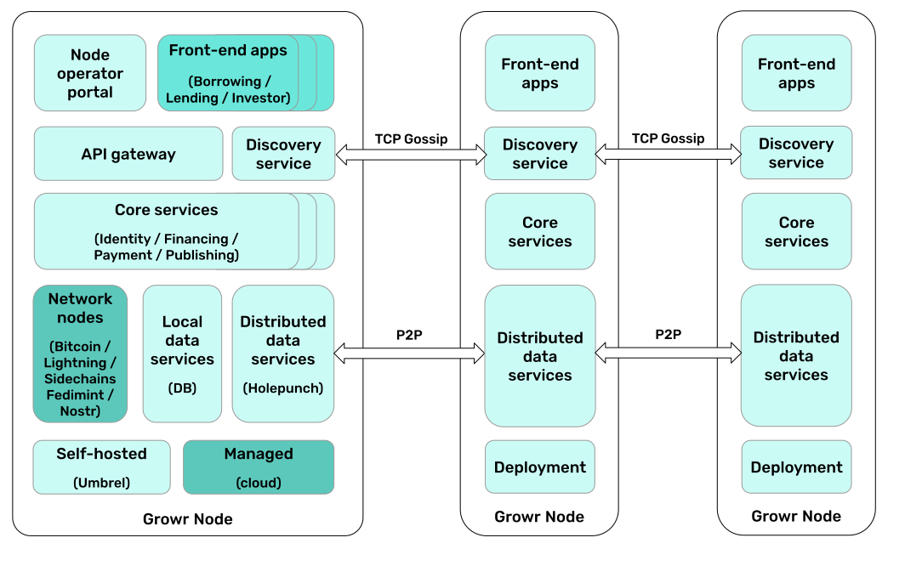

# Protocol architecture

## Overview

The following diagram provides a high-level overview of functional architecture with the open-source protocol components and the necessary apps and services for a working case example.

The protocol works as a _decentralized micro-lending marketplace_. It enables originators, using a Lending portal (Capital Provider app) or protocol’s API, to publish their loan offers with predefined conditions and eligibility criteria. The borrowers then apply to get financing based on the automatic matching of these criteria with the credentials in their self-sovereign credit record. The architecture presents the minimum set of services and applications to make the marketplace fully operational.

## Implementation-specific apps and services

At the top of the diagram are the front-facing applications and on the next layer are the supporting services. These apps and services are on top of FOSS protocols and services. They can be developed by Growr or other integrators per deployment. The protocol can be extended with other services and apps fitting the purpose.
* _Borrower apps:_ Set of applications that are used by the borrower to operate their self-sovereign credit record and to apply for funding from different projects. Depending on the local environment and user base, those might be web, mobile or USSD applications.
* _Capital Provider apps:_ Applications used by originators and investors to create and fund projects, and to monitor their performance.
* _Impact portal:_ An open-source standalone web application that can use aggregated data from the protocol to display a dashboard presenting the global impact of the marketplace.

The front-facing applications are connected to a _project-specific service layer_, which depends on each implementation. The services in this layer are responsible for the integrations with the third-party systems, for the authentication and authorization of the users, as well as for the communication with the core services of the protocol.

## Protocol core components

The core of the Growr protocol contains four groups of FOSS components. These will be maintained as open-source software under an open license and can be extended by following the community and product guidelines:
* Protocol core identity services
* Protocol core financing services
* Protocol core data services
* Protocol credit record store

All the services in these groups are deployed with proof that the running service has a well-known identity or a public key, and its code is identical to the source code in the Growr repositories.

### Identity services

The Growr protocol’s core identity services are:
* _Credential issuing service:_ Issues verifiable credentials based on data received or verified for given borrowers.
* _Credential verification service:_ Verifies presentations of credentials in order to access funding
* _SSCR agent service:_ A custodial service that operates with the self-sovereign credit of the user with his permissions.

To be trusted by all participants, the Credential issuing and the Credential verification services will have well-known DIDs and deployment addresses.

### Financing services

The Growr protocol’s core financing services are:
* _Project management service:_ Provides an API to create and manage lending projects in the marketplace. It reads and writes data to the Project book.
* _Loan management service:_ Controls the creation, utilization and repayment of loans from the marketplace. It reads and writes data to the Loan book.
* _Funding and payment services:_ A set of services with payment management functions. They provide integration with supported funding sources such as Lightning Network channels and on-chain multi-sign accounts.

### Data services

The Growr protocol’s core data services are:
* _Project book:_ Enables the creation of new projects with strictly defined eligibility criteria and a funding source.
* _Loan book:_ Enables the creation of loans after an eligibility check of the borrower against a given project.
* _Payment registry:_ Contains history of loan utilization, repayment and other related events. It supports the issuing of proof of positive credit history.
* _Read-only copies:_ Contains aggregated data plus audit logs of the above services, sanitized from any personal-revealing data. It is publicly exposed to ensure transparency in the marketplace and to monitor its global impact.

To implement those operational data storage services, the Growr protocol leverages Holepunch’s Hyperbee, an append-only B-tree based on Hypercore. The read-only copies are implemented as a Hyperswarm with published well-known Public Key and Topic.

### Protocol credit record store

The _credit record store_ provides decentralized storage of the self-sovereign credit record (SSCR) of the users. Each record represents a unique global decentralized identity and contains general-purpose and protocol-specific verifiable credentials. The credentials data is encrypted and accessible only by the identity owner.

