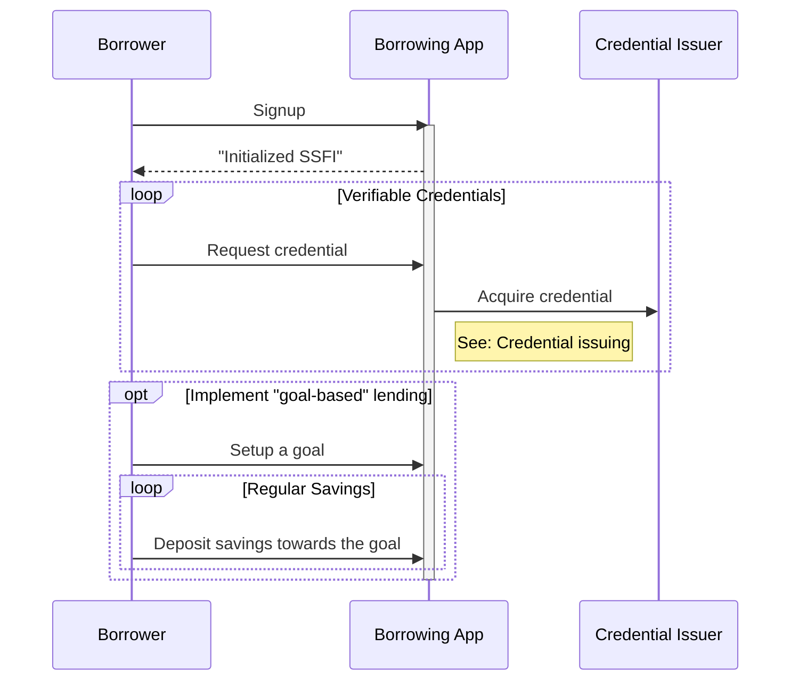

# Profile Onboarding
The Growr protocol relies on a new type of decentralized identity that we call the **Self-sovereign Financial Identity (SSFI)**. It is intended to represent user's unique global identity and to store various verifiable credentials.

The Growr protocol does not enforce any specific requirements upon wallet implementations. Wallet developers may design features and functionalities that correspond to the desired user experience. In a custodial model, the Borrowers onboard using a custodial mobile or web application in order to create their SSFI, claim credentials and apply for a loan from the protocol. In non-custodial model, the Borrower would create and manage its self-custody SSFI using a dApp.

Growr onboarding process requires several steps to be completed:
- The user must have SSFI (DID) address
- The user must collect one or more verifiable credentials and store them in his SSFI
  
The required verifiable credentials for loan application depends on the eligibility criteria of each pond, to which the Borrower has intention to apply. For more details, check [Credentials Issuing section](../layer-distribution-identity/2-Credentials-Issuing.md).  

