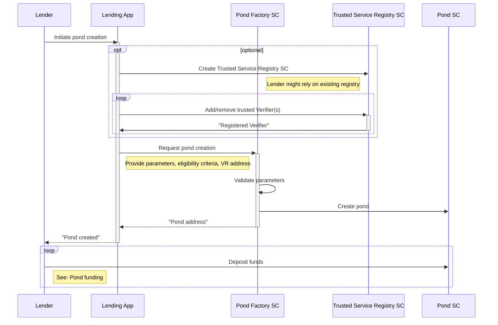
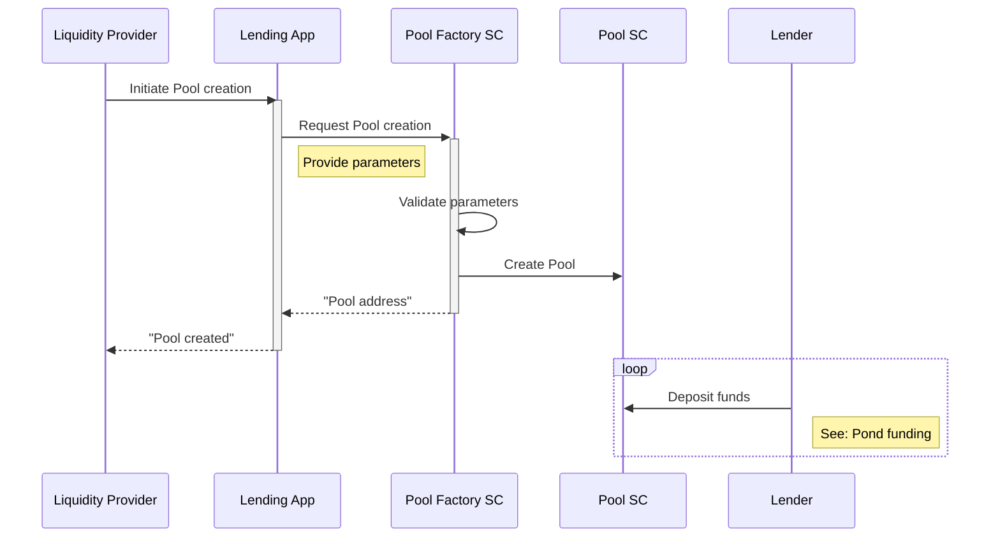

# Pond Creation

## Pond Creation
Below is a diagram that illustrates the steps for creation of a lending pond.

The parameters for pond creation includes:
- Owner
- Name
- Currency/Token
- Min & max loan amount
- Min & max loan duration
- Annual interest rate
- Disbursement fee
- Cash-back rate
- Strict eligibility criteria
- Reserve requirements
- Trusted Service Registry address

Once created, pond parameters cannot be changed. If the pond owner wants to modify certain parameters, they would create a new pond.

An important parameter of every pond is the configured address of Trusted Service Registry smart contract. The pond will rely on this smart contract to validate that the eligibility check was performed by a trusted Risk Assessor. Trusted Service Registry contracts can be created either by pond owners or by the protocol governance body (recommended).  
The protocol envisions a possibility for the owner to stop or pause the lending from a pond i.e. to permanently or temporary block future loan approvals from a pond.

## Pool Creation
The flow for pool creation is very similar to the flow for pond creation:

The parameters for pond creation includes:
- Owner
- Name
- Currency/Token
- Min & max credit limit
- Annual interest rate
- Reserve requirements