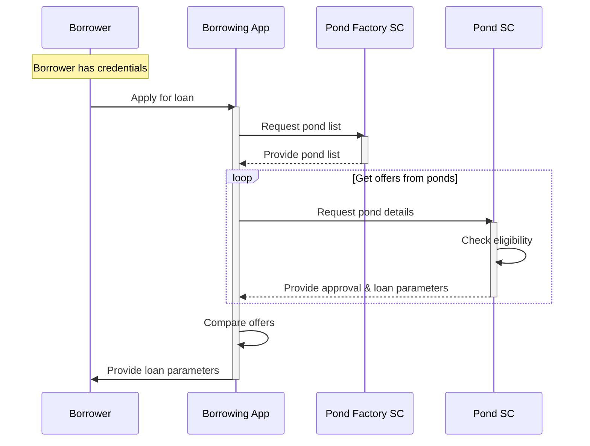

# Loan Offering
In a custodial model, the Borrowers requests a loan offer from the protocol using a custodial mobile or web application. The non-custodial loan offer flow is almost the same. The main difference is that instead of custodial app, the borrower would use a dApp with connected self-custody wallet.  
There are different scenarios for loan offering, depending on the protocol implementation, and in particular - where the pond details are stored (cached).
In scenario below, the Pond Factory smart contract holds only a list of addresses of the ponds created from its invocation requests and the Borrowing App must "ask" for details each individual pond.

