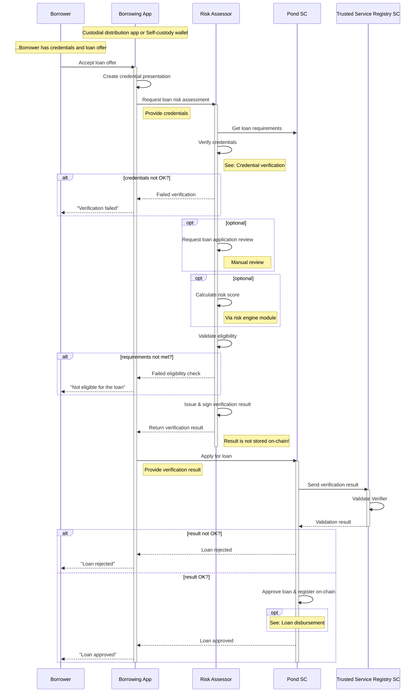

# Loan Approval
The risk assessment activities in Growr protocol are executed off-chain and then confirmed on-chain.

In a custodial model, the Borrowers apply for a loan to the protocol using a custodial mobile or web application. The non-custodial loan approval flow is almost the same. The main difference is that instead of Borrowing App, the borrower would use an Agent App with connected self-managed wallet.

The key role in the process is played by the Risk Assessor who safely and securely perform the following assessment:
- Verify that the Borrower has all the necessary credentials
- Verify that the presented credentials have valid signatures
- Optionally request and ensure that the loan application is reviewed and confirmed
- Optionally request and ensure that the Borrower has the necessary credit score
  
Upon successful completion of all verification checks, the Risk Assessor creates a lightweight privacy-preserving **Verification Result** asserting that a given Borrower matches the eligibility criteria of a given pond. The Risk Assessor hashes and signs the result and return it back to the Borrowing App for further use in the smart contract transaction. Note that the verification result does not contain credentials to prevent leakage of sensitive personal information on-chain.

Having the result from the Risk Assessor, the Distributor calls the loan application function of the Pond smart contract. The latter passes the verification result and Risk Assessor's signature as parameters to the Trusted Service Registry contract function for validation. The registry uses the signature and the verification result to confirm whether or not the result corresponds to the public address of a trusted Verifier configured in the registry contract.

After validating the Borrower and before approving the loan, the pond performs the following final checks:
- General pond check:
  * Pond is not stopped
  * There are available funds in the pond i.e. pond available funds > requested amount
- Loan request check - compare loan request parameters with smart contract's parameters:
  * User SSFI address with verifiable credentials -> not empty
  * Requested loan amount -> between Min and Max amount; if outside of the range, the pond approves the nearest amount but does not reject the request
  * Request loan duration -> between Min and Max duration; if outside of the range, the pond approves the nearest amount but does not reject the request
- Eligibility check:
  * By receiving confirmation of the verification result from the Trusted Service Registry smart contract
  
Once the loan is approved, the smart contract registers it on the chain and returns a response with the following parameters:
- Approved amount
- Approved duration (in months)
- Interest rate (APR) %
- Disbursement fee %
- Cash-back rate %
- Interest amount ( = Amount x APR x Duration/12)
- Total amount to be repaid ( = Amount + Interest amount)
- Installment amount ( = Total amount / Duration)
  

