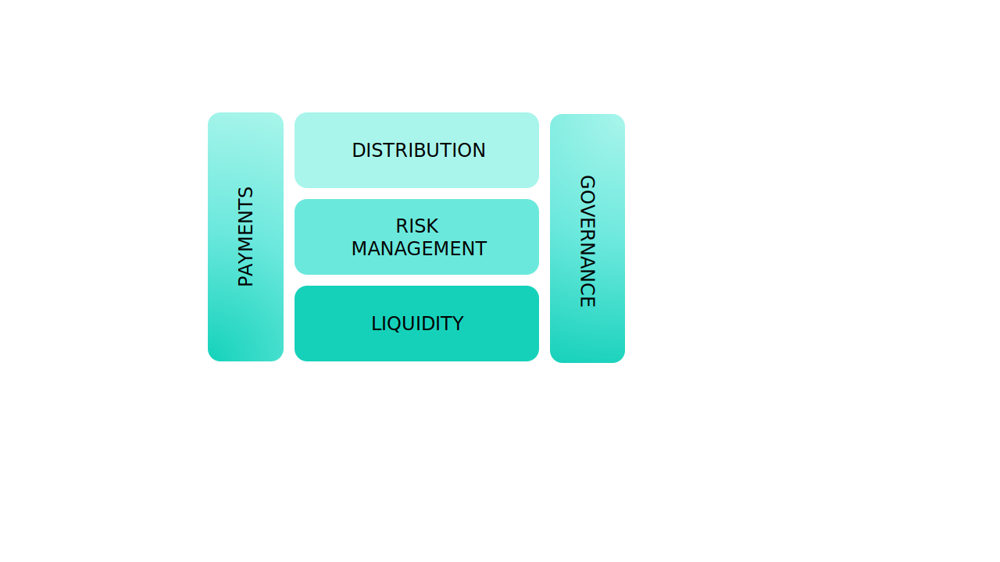
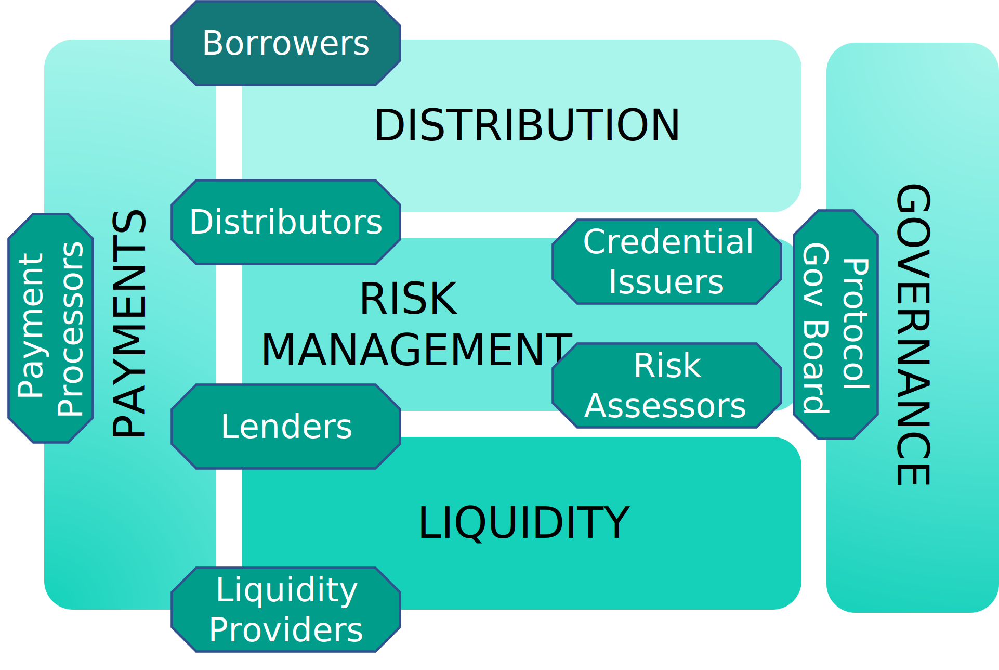
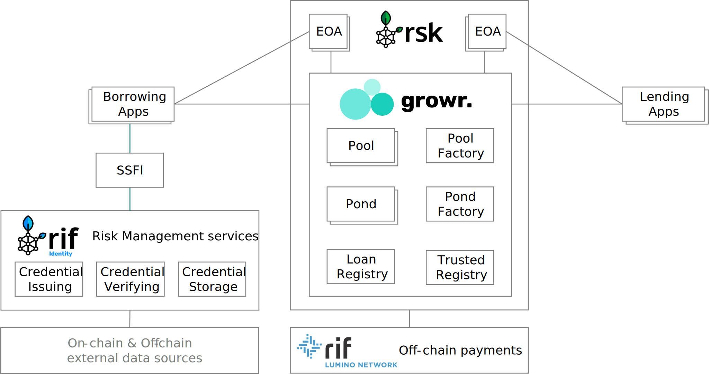
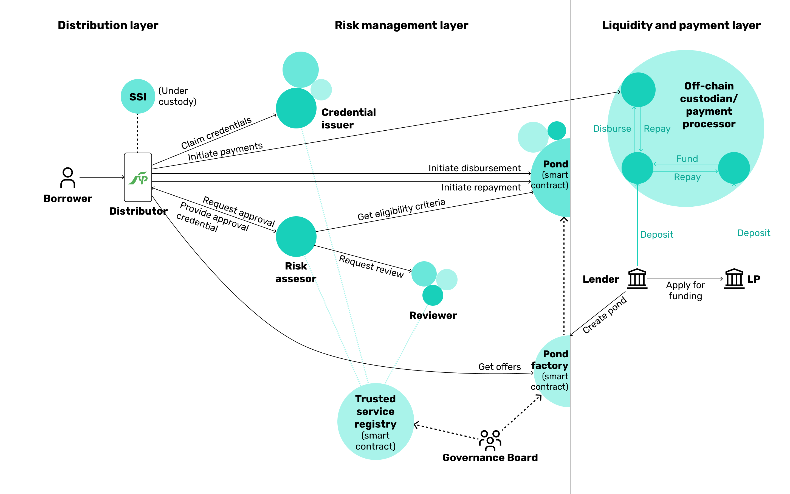
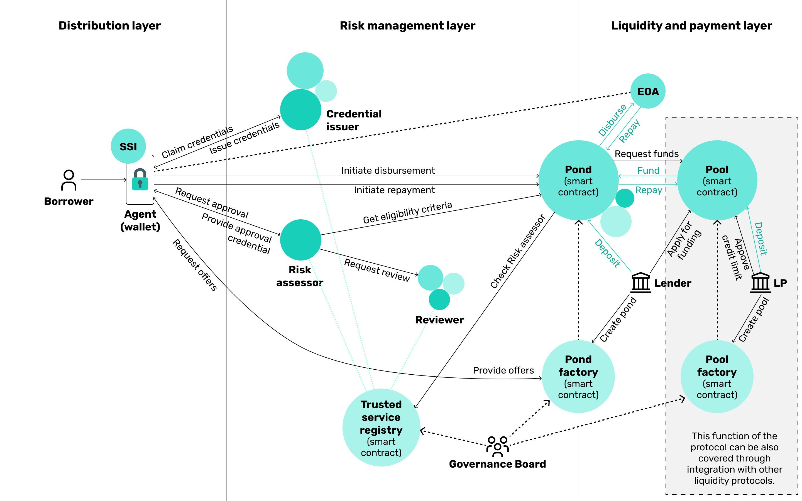

# Abstract
Growr is an open, fair and sustainable lending protocol on top of Bitcoin. Growr enables institutional and individual investors to fund lending pools according to their risk/reward appetite, and borrowers to apply for and receive unsecured or partially secured loans. It combines instant unsecured loans, innovative credit assessment models, decentralized identity and financial health incentivization in order to address financial inclusion globally.

Financial health metrics are combined with additional off-chain data and on-chain loan reputation to create a new type of decentralized identity that we call the Self-sovereign Financial Identity. It contains verifiable credentials from different sources and is presented in front of lending pools to assert creditworthiness. For its part, the lending part of the protocol operates on 2 levels. Global lending pools are funded by large investors who then delegate the actual lending activity to local guilds having their local lending ponds.

By building Growr, we are addressing significant global challenges such as access to financial services at fair conditions, gender inequality and bad financial health. Bringing true value to all protocol participants, Growr could be a catalyst for the next wave of exponential adoption of DeFi ecosystem and in particular RSK network.

# Protocol Overview

## Problem
Financial health is an important factor in our daily life. However, bad financial health is plaguing the world. More than half of the global population is living paycheck-to-paycheck without any savings [(link)](https://globalfindex.worldbank.org/sites/globalfindex/files/chapters/2017%20Findex%20full%20report_chapter5.pdf). In addition, almost 2 billion adults in the world do not have access to financial services [(link)](https://ufa.worldbank.org/en/ufa) or if they do, they  fall prey to financial sharks and receive loans at a very high interest rate. Moreover, there are still 72 countries where women from specific social groups do not have the right to open a bank account or obtain credit [(link)](https://www3.weforum.org/docs/WEF_GGGR_2020.pdf).

At the same time, even people who have savings in cash or in a bank account are also impacted. On the one hand, macroeconomic events, such as high inflation, are literally “eating their money” and on the other hand, they are not able to acknowledge the disruptive change that is happening to the financial system.

Today, most financial service providers do not solve those problems. They are clueless about people's real-life problems, needs and aspirations. There's a complete disconnect between the person and the provider. Banks, and even more so non-banking lenders, have a negative image especially with younger generation, who, as a result, are more likely to go to the dentist than visit a bank

## Solution
We propose the **Growr protocol** as a bridge to a new global financial environment. The Growr protocol advances financial inclusion by enabling borrowers to receive fair & instant unsecured loans based on a self-sovereign identity.

Growr protocol addresses the problems stated above with the following elements: 
- **Growr core protocol** – a decentralized smart contract ecosystem for funding and consuming loans on top of the RSK blockchain, with open access for everyone.
- **Self-sovereign financial identity (SSFI)** – a digital identity, based on W3C DID standard, owned and managed by the user.
- **Protocol access via web and mobile applications** - a simple and secure way for consumers and merchants to easily apply and obtain fair loans.
- **Credit risk assessment** – a framework for establishing trust using a combination of alternative approaches such as on-chain activity, trusted off-chain sources, peer vouching, and others.
- **Growr DAO** - a future decentralized autonomous organization for protocol governance and fair compensation of protocol contributors.

Growr protocol is built around the foundation Growr values:
- **Freedom**. Growr ensures equal starting point and free access to the protocol for everyone.
- **Transparency**. Growr provides services with fair conditions, end-to-end transparency in the process and visible impact.
- **Contribution**. Growr promotes open-source, community-driven, and safe environment.
- **Empowerment**. Growr delivers global life-first innovative financial services.
  
## Benefits
The Growr protocol distributes the generated value fairly between all ecosystem participants.

### For Global Investors
Growr protocol delivers value to **global investors** as Liquidity Providers:
- Yield generation on excess capital
- Flexibility in defining risk/reward preferences in a global marketplace
- End-to-end transparency in capital allocation

### For Local Communities
Growr protocol delivers value to **local communities** and **last-mile financial service providers** as Lenders and Distributors:
- Access to credit from a global marketplace
- Facilitation of access to credit for community members by managing local risk policies and enabling social vouching 
- Yield generation for local lenders
- Revenue growth for merchants through buy now, pay later scheme

### For Borrowers
Growr protocol delivers value to **borrowers**:
- Access to loans for unbanked and excluded population
- Loans with fair conditions 
- Self-sovereign credit record 
- Promotion of financial health and savings accumulation

# Key Concepts

## Decentralized identity
### DIDs
Growr protocol implements W3C’s standard for decentralized identity (DID). DID is a new type of identifier that enables verifiable, decentralized digital identity. A DID refers to any subject (e.g., a person, organization, thing, data model, abstract entity, etc.) as determined by the controller of the DID. DIDs have been designed so that they may be decoupled from centralized registries, identity providers, and certificate authorities. Specifically, while other parties might be used to help enable the discovery of information related to a DID, the design enables the controller of a DID to prove control over it without requiring permission from any other party. DIDs are URIs that associate a DID subject with a DID document allowing trustable interactions associated with that subject

### VCs
Growr protocol implements W3C’s standard for **Verifiable Credentials (VCs)**. VC is a tamper-evident credential that has cryptographically-verified authorship. They can be used to build universally verifiable presentations, which can also be cryptographically verified. Verifiable Credentials (VC) are global uniformed provable claims associated with the subject of the DID. They are cryptographically secure, privacy respecting, and machine verifiable.

Verifiable credentials are provided by **Credential Issuers** – that is, centralized or decentralized third parties, asserting certain facts about the DID owner. Verifiable credentials are consumed by **Verifiers** using the concepts and data models for **presentation exchange**. Verifiers verify that:
- The credential presentation is signed with the subject's DID.
- The credential is signed by a trusted Issuer.
- The credential is not expired.
- The credential is not revoked.

### Growr's Self-sovereign financial identity
The Growr protocol relies on a new type of decentralized identity that we call the **Self-sovereign Financial Identity (SSFI)**. 

The SSFI is intended to represent user's unique global identity and to store various protocol-specific verifiable credentials, such as:
- *KYC Credential*. This credential proves successfully passed KYC process (including AML/CFT risk check) and can be issued by any last-mile provider or a third-party traditional identity verification service.
- *Credit Score Credential*. This is a "combined" credential, summarizing other atomic credentials, and representing the overall credit score of the Borrower.
- *Financial Health Credential*. This is a special credential issued by trusted services for succeessfully passed education and mentoring "financial health treatment".
- Social Vouching Credentials*. This credential is received by endorsement from other protocol users, who have certain reputation level and/or are trusted by the protocol.
- *Savings History*  Credential. This credential proves that the user is making regular micro-payments to his saving account. It could be issued by any trusted financial institution (where the user has a saving account) or trusted financial data processing service (to which the user provides account statement information).
- *Loan History Credentials*. This is a credential, issued by the protocol and earned through regular on-time repayments of past loans.

## Decentralized lending
### Lending protocols
Decentralized Finance (DeFi) have the potential to fundamentally reinvent the financial infrastructure enabling people to transact with each other globally, securely and permissionless. Important share in the DeFi ecosystem is taken by decentralized lending protocols and liquidity markets.

Decentralized lending protocols let users lend or borrow digital assets without going to a centralized intermediary. Users deposit digital assets into liquidity pools, which become funds that the protocol can lend out to other users. A specific characteristic of the most popular protocols is that they require a collateral. This means that onchain assets of the borrower are used to secure a loan. The borrower provides the asset to secure the loan, and if the borrower defaults on the loan, the lender can take possession of the asset and sell it to cover their loss. Moreover, they often require overcollateralization i.e. the amount of locked assets as collateral exceeds the loan amount.

### Growr's Decentralized risk management
Growr protocol approaches lending differently. The protocol aims at providing instant insecure loans based on risk assessment instead of requiring an on-chain collateral. Smart contracts are usually not technically capable and economically practical at executing credit risk assessment operations themselves, and they cannot call upon external risk assessment services beyond the constraints of their own chain. Therefore, the credit risk assessment, the exchange and verification of credentials are all executed off-chain and then confirmed on-chain in a way that no personal data is stored on-chain.

Growr protocol introduces an innovative approach for decentralized credit risk management, in which the responsibility is split between all protocol participants. 
- *Credential Issuers* assert facts about the borrowers in the form of credentials.
- *Credential Verifiers* validates the credentials.
- *Risk Assessors* orchestrate the risk assessment activities and confirms that a borrower matches the loan requirements.
- *Trusted Registries* validate that credentials are issued by trusted issuers and risk assessments are prepared by trusted risk assessors.
- *Smart Contracts* take decision based on the input from the above-mentioned risk management service providers.
- *Protocol Governance Board* decides which participants are trusted and excludes the ones that misbehave.

Each participant is incentivized by the protocol to fairly fulfil its duties, as follows:
- With positive behaviour in terms of regularly repaid loans, *Borrowers* increase their credit risk score. And better risk score translates to better lending conditions - increased amount limit and decreased interest rate.
- *Credential Issuers*, *Credential Verifiers* and *Risk Assessors* receive a fee for the services they provide. In case of poor execution of their risk management function, the respective participant is blacklisted from the protocol. In addition, risk management service providers might be required to stake protocol tokens as a guarantee for their fair participation.
- *Lenders* and *Liquidity Providers* distribute part of the profit with all participants to motivate them to properly execute their risk management functions in order to decrease their cost of default and respectively to increase their profit.

### Growr's 2-level pooling
The Growr protocol is able to operate on 2 levels – global pools and local ponds. Global pools are funded by Liqudity Providers who then delegate the actual lending activity to local guilds with local lending ponds.

A lending pool can be created by any institutional investor with enough capital (threshold to be defined by the protocol governance) who specifies the initial pool parameters. Liquidity Providers can safely deposit funds into lending pools according to their preferences and based on automatic vetting using their own SSFI and Verifiable credentials, e.g., applicable AML/CFT checks, required by the pool creator.

Lending ponds are created by local lenders. Different lenders have varying levels of risk tolerance, depending on the laws and regulations in their jurisdictions, as well as on their profit goals. Therefore, each pond can have its own parameters (such as loan amount and duration ranges), rates and eligibility criteria.

Local ponds apply for funds from the pool resulting in so called "contract-to-contract (C2C) lending". Depending on the pond financing period, fund requirements, proposed risk model and eligibility criteria, the pool owner decides to approve (whitelist the Pond address in the Pool smart contract) or not the funding to the pond.

Based on the Pond utilization, the Pond smart contract can automatically apply to the Pool smart contract for a loan (up to the approved credit limit). The Pond is required to regularly repay the interest fee to the Pool. Depending on the configured utilization threshold, the Pond can repay partially or fully the loan to the Pool smart contract. 

Therefore, the protocol implements automatic pond liquidity management. Moreover, in some of the future protocol versions, we envision integration with lending pools of other liquidity protocols.

### Financial health

### Financial health dimensions
Dealing with money, especially borrowed from others, requires knowledge and high responsibility. That’s why it is very important that everyone gets a financial health treatment for long-term improvement of their financial health. It’s not about a single transaction, but achieving more throughout people's lives, and ultimately reaching a better lifestyle and financial independence.

Financial Health treatment includes building knowledge and proper habits in 4 financial dimensions:
- *Spending*. The Spending dimension is measuring how well people are balancing between the money they earn and the money they spend. Surprisingly, even people who earn a lot can spend their income without thinking too much. As a result, they live a paycheck-to-paycheck lifestyle, which prevents them to follow their dreams. Budgeting is a powerful tool!
- *Savings*. The Saving dimension shows how people are doing in terms of putting some money aside. Many people do not understand where to keep their money in order to protect it from inflation and other dangers that may prevent it to keep its value over time. Savings take people's financial life in their hands!
- *Borrowing*. The Borrow dimension demonstrates how well people are able to manage their debt. It asseses whether people are debt-free, whether they feel comfortable having a loan, and whether their debt is manageable or too much and leading to overdue payments.  Debt is not always bad – if people know how to use it!
- *Planning*. The Plan dimension is perhaps the most important indicator for people's ability to maintain financial health in the long run. Most people do not have a systematic approach to considering two key elements in financial planning -  potential risks and key life events in the future. Tomorrow starts today!

### Growr's incentivization concept
The Growr protocol incentivizes good financial health – that is, improving financial literacy and behaviors. 

To promote improving financial literacy and behaviors, Growr protocol encourages the implementation and use of the following concepts:
- **"Learn and earn"**; that is, before applying for a loan, the user must go through education and mentoring program in order to collect credentials for financial health improvement.
- **"Goal-based" financing**; that is, before applying for a loan, the user must declare a specific goal related to his/her real-life need, and deposit initial savings towards it.
- **"Savings discipline"**; that is, before applying for a loan, the user must create a saving habit by executing regular micro-payments to his saving account.

# Protocol Participants

## Layers
  

Growr is a DeFi protocol operating on several layers:
- The processes in **Liquidity layer** are related to provisioning of the necessary funds for the protocol operation. Liquidity Providers and Lenders are collaborating on this layer.
- The **Risk Management layer** is the key layer of the protocol, it's the "magic" of the protocol. All processes related to local scoring and assessment, and loan management are happening on this layer.
- The **Distribution** layer covers the processes of onboarding and providing Borrowers with access to the protocol.
- The **Payments** layer combines all payment processes that occurs accross all layers.
- The processes for smart contract governance and fraud prevention are covered in the **Governance layer**.

There are different players operating on each protocol layer, as well as between layers. Overview of all participants is presented below:

## Borrowers
**Borrowers** get easy access to fair loans. They apply for funds from ponds with matching risk requirements and repay the funds with added interest and/or fees.
Borrowers gradually receive better conditions for positive behavior and improved financial health. They will receive “cash back”-style rewards based on their improved financial health (i.e., regular loan repayment and proof of financial learning), as well as for referral of good Borrowers.

Borrowers can access the protocol via a Distributor in custodial model or via a decentralized App in non-custodial model.  
Borrowers usually operate on the *Distribution* layer.

## Distributors
### Custodial Model
**Distributors**, or also called **Last-mile Providers** or **Custodial Wallet Providers**, intermediates access to the protocol to a specific group of Borrowers in custodial model with a simple UX. Distributors can be regulated financial institutions/fintechs, merchants, employers, or others. We envision that some Distributors may even operate as decentralized entities (DAOs).  
The role of the Distributor is to onboard and vet the users into its own digital means (e.g., a mobile application) and then facilitate access to the protocol. In this model, the user will have their SSFI under the custody of the Distributor.  
Often, a Distributor might be the same as a Lender.

Distributors usually operate on the *Distribution* layer and interact with *Risk Management* layer. In some cases, they might also have a role in the *Payments* layer.

### Non-Custodial Model
The end-user access to the protocol might be also provided in a fully decentralized non-custodial model. In this scenario, the user can access the protocol directly or through an agent wallet (decentralized web app with connected self-managed SSFI).

## Lenders
**Lenders** facilitates the interaction with the protocol as they create and fund ponds using own funds or by borrowing from global pools. Lenders can be regulated financial service providers, local communities or even governments.

They will receive yield based on the pond profitability, and the pond yield will tend to be higher than the pool yield, rewarding the skin-in-the-game participation of the Lender.

Lenders operate on *Risk Management* and *Liquidity* layers.

## Liquidity Providers
**Liquidity Providers (LPs)** are global institutional investors and high-net-worth individuals (HNWIs) who provide funding to the lending pools in the protocol and then delegate the actual lending activity to the Lenders.

Liquidity Providers allocate capital to lending pools and get rewarded with yield based on the pool profitability. Generally, the global pool yield will tend to be lower that the pond yield due to the wholesale lending nature of pools.

Some Liquidity Providers could play a role of **Guarantor** to provide first-loss capital and cover for missing credentials certain specific borrower groups (e.g., women, employees, unemployed, community members, companies of a given chamber, etc.). Guarantors will deposit funds into a Safety Fund, from which certain ponds can claim money in case of payment incidents.

Liquidity Providers operate on *Liqudity* layer.

## Credential Issuers
**Credential Issuers** serves an important risk management role in the protocol. They are centralized or decentralized third parties that provide **verifiable credentials (VCs)** to protocol participants.

Credential Issuers will receive a fee for the credentials they are issuing to Borrowers and other participants.

Credential Issuers operate on *Risk Management* layer.

## Risk Assessors
Credit risk assessment is a crucial component of the Growr protocol. Due to the decentralized nature of the protocol, we envision a decentralized credit risk assessment process with several participants in it.

A key participant is the **Risk Assessor** who provides a verification result assesting that a given Borrower matches the eligibility criteria of a given pond.
  
The Risk Assessors could be "owned" by Lenders, Liquidity Providers or Distributors to ensure they can manage their own policies, or could be provided by third parties (even by TradFi players).

The Risk Assessor may play one or several of the roles below. For the execution of its service, the Risk Assessor is rewarded with a fee according to its usage.

Risk Assessors operate on *Risk Management* layer.

### Credential Verifier
Credential Verifiers consumes credential presentations and verify that the credentials are valid i.e. issued from trusted Issuer, not expired, and not revoked.

### Credit Risk Scoring
In case of a more sophisticated pond eligibility requirements, Risk Assessor might implement a module for additional credit assessment/scoring techniques, including scorecards, ML models, and others. The result of this additional assessment is as a credit score, which is then matched with the pond's credit score requirements.

The Credit Risk Scoring could also participate in the protocol as a standalone Credential Issuer. 

### Credit Risk Reviewer
**Risk Reviewers** are employed by a Risk Assesor (or the protocol itself) to review a loan application and interview the Borrower in order to generate additional confirmation or vouching credentials used to endorse her/him.

The Credit Risk Reviewers could also participate in the protocol as individual Credential Issuers.

## Payment Processor
Payment Processors facilitates the payment processes in the protocol by providing different off-chain payment services. On the one side, they can privide on-ramp and off-ramp services, and on the other side, they facilitate and settle fiat payments between:
- Borrowers and Lenders
- Lenders and Liquidity Providers
  
For more information, see [Off-Chain Payments section](../layer-payments/2-Offchain-Payments.md).

Payment Processors operate on *Payments* layer.

## Protocol Governance Board
For the first version of the protocol, we envision to begin with a more centralized governance. At a later stage, decentralization will be implemented through a governance token that will be progressively airdropped to the most active contributors based on a predefined scheme. The protocol will ultimately be governed by a **DAO**, whose members will be all the protocol stakeholders. Each stakeholder will have voting rights based on their contribution to the protocol development and governance.

The Protocol Governance Board covers activities related to smart contract governance and fraud prevention. For more information, see [Protocol Governance section](../layer-governance/2-Protocol-Governance.md).

Naturally, Protocol Governance Board operates on *Governance* layer.
# Protocol Components

Growr protocol ecosystem consists of the following components:
- **Core Protocol**. Growr protocol is a smart contract system for decentralized lending on top of RSK.
- **SSFI**. A unique global decentralized identity storing various protocol-specific verifiable credentials.
- **Protocol Apps**. Custodial or non-cunsotidal web and mobile applications, integrated with the protocol. Include:
  * *Borrowing Apps*. End-user web or mobile application for the Borrowers.
  * *Lending Apps*. dApps for lending pools and pond management.
  * *Governance Apps*. dApps for protocol monitoring and changes implementation.
  * Apps that combines more than 1 function.
- Integration with **Third-party services**.
  * *Credential issuing services*
  * *Credential verification services*
  * *Credential storage services*
  * *Payment services*
# Protocol Processes

## Processes
Growr protocol's operation is defined by a framework consisting of the following processes:
- Distribution & Identity
  * Onboarding
  * Credentials issuing
  * Credentials verification
- Risk Management
  * Loan Offering
  * Loan Approval
  * Loan Disbursement
  * Loan Repayment
  * Loan Collection
  * Loan History
- Liquidity
  * Pond Creation
  * Pond Funding
  * Pond Profitability
- Payments
  * On-chain Payments
  * Off-chain Payments
- Governance
  * Protocol Governance

The Growr protocol aims at standardization of the above processes, and this is especially valid for the risk management processes. However, depending on the protocol participants and the tools and services they use, details about certain process implementation might vary. In general, we can summarize the implementation models in 2 categories - custodial and non-custodial.

## Custodial Model
In custodial model, the Borrowers access the protocol via Borrowing app, provided by regulated last-mile financial service providers. The self-sovereign financial profile is also under custody. Payments are managed by off-chain custodian (payment processor).

## Non-Custodial Model
The non-custodial model allows full decentralization of the protocol. Borrowers access the protol using a dApp having their wallet connected and all translactions are executed on-chain.

# Use Cases

## Consumer credit
Consumer credit in the developing world often suffers from unfair conditions provided to people from specific minority groups or those without credit history. Using alternative credit risk assessment data via an open protocol can democratize access to consumer credit at fair conditions.

## Microfinance
The global microfinance market amounted to $124B in 2018 [(link)](https://www.convergences.org/wp-content/uploads/2019/09/Microfinance-Barometer-2019_web-1.pdf). 139.9 million borrowers benefited from the services of microfinance institutions, compared to only 98 million in 2009. Of these 139.9 million borrowers, 80% are women and 65% are rural borrowers. The main regions of microfinance are Latin America with $48.3B, South Asia with $36.8B, East Asia and Pacific with $21.5B, Africa with $10.3B. Connecting this market to a global protocol will bring efficiency in capital allocation, fair conditions, and transparency of the impact.

## Buy now pay later
The global buy now pay later market size is expected to reach USD 20.40 billion by 2028, registering a CAGR of 22.4% from 2021 to 2028 [(link)](https://www.researchandmarkets.com/reports/5416019/global-buy-now-pay-later-market-size-share-and). However, this business model remains out of reach for micro-merchants in the developing world. Enabling access to a global lending protocol at a local shop could prove transformational for the local communities.

## Lending to vulnerable social groups
Vulnerable populations such as victims of violence and micro-merchants from poor communities are a prime beneficiary of the protocol. Such populations can rely on memberships within local associations, who can become both credential providers and funding donors.

## Donation impact transparency
In addition to lending, donations can also benefit from a global and open protocol, giving the donors a complete transparency of the impact of each dollar they give.

## Informal community savings groups
Over the last 25 years, development organizations have trained about 750,000 savings groups, with over 15M members, across 73 countries [(link)](https://mangotree.org/what-are-savings-groups). Digitalizing such savings groups can bring about a global revolution in financial health as more communities get access to and begin to utilize this concept.

## Crypto credit cards
While credit cards are a dominant consumer credit facility in the developed world, there are still no real “crypto” credit card products without collateral. Card schemes such as Visa and MasterCard are promoting themselves as being “crypto-friendly.” Therefore, our proposed protocol combined with a credit card facility can be a great solution to leverage the existing card payment rails.

## Crowdfunding
The crowdfunding business model continues to grow fast globally. In addition to the established platforms for investment in startups and product R&D, impact finance providers such as Kiva are helping microbusinesses with loans for as little as $25. Crowdfunding transition to the blockchain is a matter of time, as the example of Kickstarter shows [(link)](https://techcrunch.com/2021/12/08/kickstarter-plans-to-move-its-crowdfunding-platform-to-the-blockchain).

# Challenges

## Regulatory compliance
Lending services are regulated everywhere in the world. Crypto lending, in particular services provided by decentralized protocols, has succeeded in achieving regulatory arbitrage. The Growr protocol will aim to strike a balance between covering regulation at the "last mile” of consumer financing depending on the jurisdiction and the locally residing stakeholders through which the protocol services are delivered, and the supranational decentralized space outside of the reach of traditional regulators. 

## Credit risk assessment
While we plan to leverage verifiable credentials from traditional credit bureaus, we envision a future with more decentralized credit risk assessment based on alternative data sources. This is mostly uncharted territory and may lead to lower yield for investors or even losses due to incorrect calculation of the cost of risk.

## Governance
While protocol governance is not novel, setting up a global DAO with complex roles and coordinating them poses still unknown challenges. We will continue to explore the best practices in the space and leverage DAO success stories.

## User experience
Setting up Bitcoin and RSK wallets is still complicated for technically unsophisticated users. As part of the work on the Growr protocol, we will seek the most user-friendly implementations for accessing the protocol and interacting with its smart contracts, including facilitating access through custodial solutions.

## Fraud
We expect that such a protocol will be a high-interest target of fraudsters. We will work on developing the right anti-fraud measures including permanent blacklisting of users from accessing the protocol services.

## Technology maturity
Some of the technologies described in this whitepaper are new and unproven at such scale. We aim to leverage as much as possible the experience of other projects and avoid technology pitfalls.

# Final Notes

## ToDo
You are reading first version of Growr protocol documentation, intended to present the high-level design of the protocol for public feedback. It should not be considered complete or final. Future revisions will address incomplete elements and currently unforeseen aspects and issues.

The present Growr documentation version is *0.2*.

## Feedback
Our goal is to develop Growr as an open source protocol. Lending, yet decentralized uncollateralized lending, is a very complex topic and there are many aspects that yet to consider. We welcome your input on how to improve the protocol.

Please, submit an issue or pull request at [Growr documentation repo in GitHub](https://github.com/growr-xyz/growr-documentation/).

## Contribution
Growr protocol is an open-source decentralized project and anyone can permissionlessly contribute to its development. We truly hope that the mission and values we describe inspire teams across the world to join us and help contribute to the protocol.

Join us!
- [Growr repos in GitHub](https://github.com/growr-xyz)
- [Growr official web site](https://www.growr.xyz)
- [Growr in Twitter](link)
  
