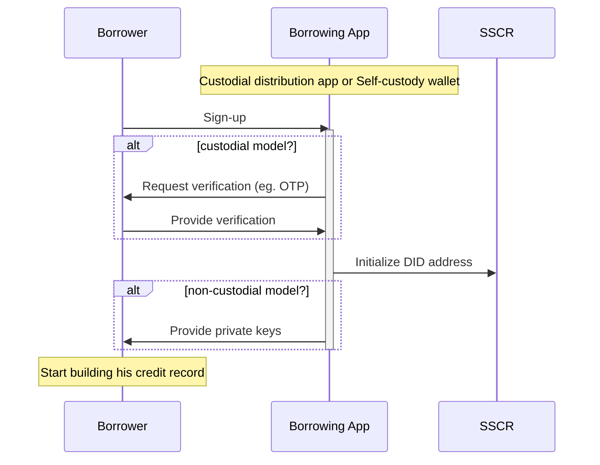

# Borrower Onboarding

The Growr protocol does not enforce any specific requirements upon wallet implementation. Wallet developers may design features and functionalities that correspond to the desired user experience. 

In a custodial model, the _borrowers_ onboard using a mobile or web application provided by a _distributor_, such as telcos, retailers, digital wallets and fintech providers. The distributor onboards the users into their application and then facilitates their access to the protocol. The private keys of the user wallets are managed by the distribution app.

In a non-custodial model, the _borrowers_ would use a borrowing dApp to create and manage their self-custody wallet, then claim credentials and apply for a loan from the protocol without involving a third party.

During onboarding, the key step is to assign a unique DID address to every _borrower_. The address is generated using an SSI framework.

Below is a diagram that depicts the process:

