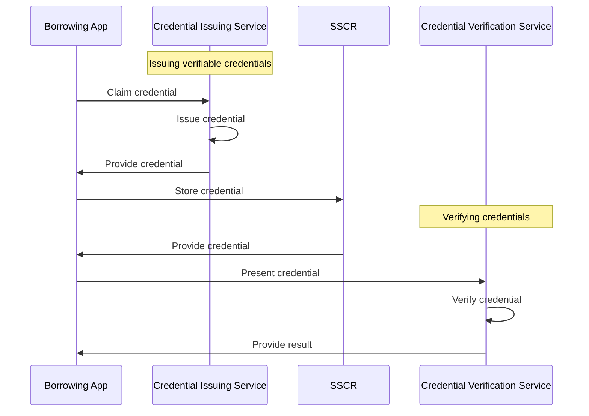
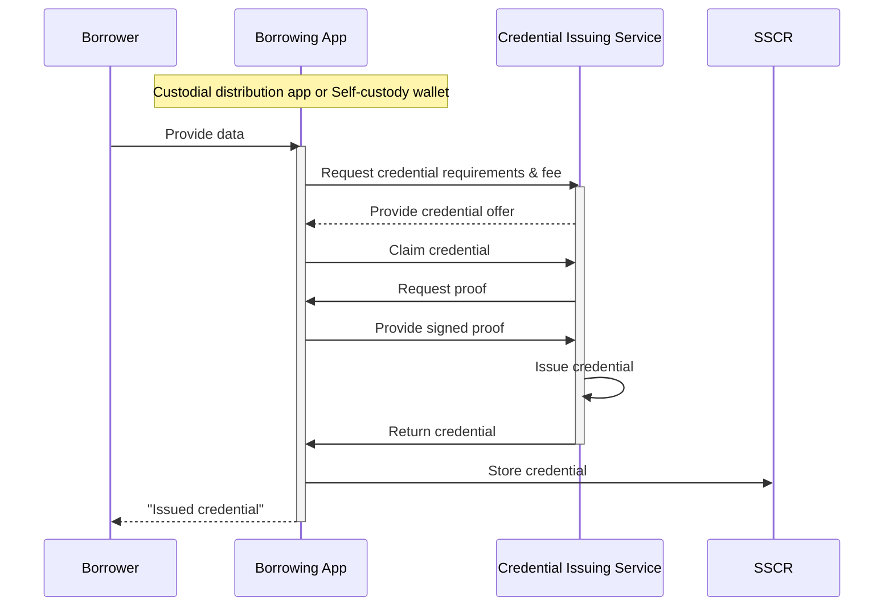
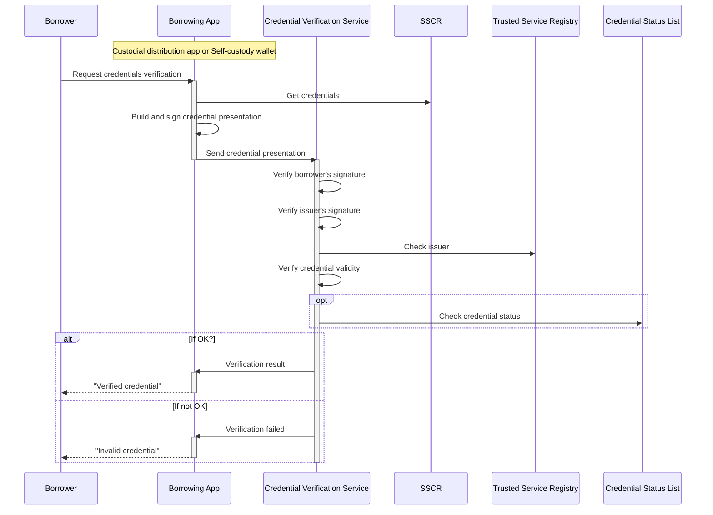

# Borrower Credit Record

## Credit Record and Verifiable Credentials

The Growr protocol relies on a new type of decentralized identity that we call the **Self-sovereign Credit Record (SSCR)**. The _SSCR_ is intended to represent a borrower's unique global identity and financial record, storing various general-purpose and protocol-specific verifiable credentials. 

The _SSCR_ contains both hard information (facts such as credit score and history, debt-to-income ratio, bank account verification, and business financial indicators) and soft information (such as endorsement, community membership, and self-declared business plans) that are used in the credit risk assessment.

The verifiable credentials, stored in _SSCR_, are issued by trusted third parties called _credential issuers_. The credentials are issued and owned by the _borrower_, who is the subject of the credential. The _borrower_ presents a given set of his credentials when applying for a loan from the marketplace.

Below is a high-level diagram that depicts the lifecycle of the verifiable credentials:

## Credential Issuing

Below is a standard process for issuing verifiable credentials:

## Credential Revocation

_Credential issuers_ might need to revoke a certain credential before it expires, eg. when the subject is no longer eligible for the credential or when they need to correct or update the information in the credential. To achieve this, they must implement the W3C's architecture design for Status List. According to this pattern, during credential issuing, the issuers would embed in the credential a URL to fetch a revocation list and the index in this list that corresponds to the given credential.

## Credential Verification

Below is a standard process for verifying credentials:

