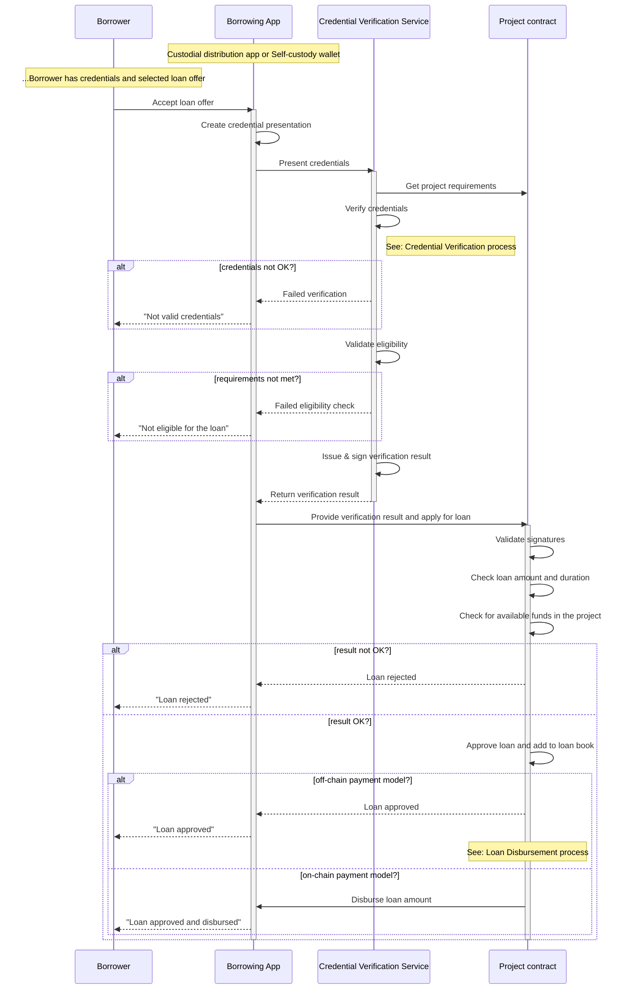

# Loan Application

## Loan Offering

The *borrowers* request a loan offer from the decentralized marketplace using a custodial or non-custodial borrowing application. 

There are different scenarios for getting the loan offers, depending on the protocol implementation, and in particular - how the project details are stored (cached). In the presented process below, the *Project Factory smart contract* holds only a list of addresses of the *Project smart contracts* and the *borrowing application* must "ask" each *Project smart contract* for its details.

## Loan Approval

When *borrowers* apply for a loan from the decentralized marketplace, the loan approval process in the protocol is performed in an innovative decentralized manner. The goal is to validate the credentials of the borrower and to assert his/her eligibility to receive a loan from a given project.

Smart contracts are usually not technically capable and economically practical at executing verification operations themselves, and they cannot call upon external services beyond the constraints of their chain. Therefore, the loan approval through exchange and verification of credentials is executed off-chain and then confirmed on-chain in a way that no personal data is stored on-chain. 

In the loan approval process, the responsibility is split as follows:
- *Risk Assessors*, owned or trusted by the *Project Owner* determine project risk parameters, required credentials and whitelisted verification services.
- *Credential Issuers* assert facts about the borrowers in the form of credentials.
- *Credential Verification Service* validates the credentials and asserts the borrower's eligibility to receive a loan from a given project.
- *Project smart contracts* validate the signatures of the borrower and verification service and ultimately approve the loan.

Below is a diagram that describes the process:

## Loan Parameters

Once the loan is approved, the *Project smart contract* registers it in its loan book and returns a response with the following loan parameters:

- *Owner:* Address of the borrower
- *Approved loan amount:* requested by the borrower but if outside of the predefined project range, then it is the nearest acceptable
- *Approved duration (in months):* requested by the borrower but if outside of the predefined project range, then it is the nearest acceptable
- *Interest rate (APR) %:* Depending on project parameters and borrower's credentials
- *Interest amount:* Formula = Amount x APR x Duration in months / 12
- *Total amount to be repaid:* Formula = Amount + Interest amount
- *Installment amount:* Formula = Total amount / Duration in months
- *Document Ref Id:* Id of a payment document that will assert the loan disbursement (in case of an off-chain payment model)

Loan parameters cannot be changed after the loan is created.

## Privacy

Upon successful completion of all verification checks, the *credential verification service* creates a lightweight privacy-preserving **verification result** asserting that a given *borrower* matches the eligibility criteria of a given project. The *credential verification services* hashes and signs the result such as it does not contain any information from the borrower's credentials, thus preventing the leakage of any sensitive personal information on-chain.

In addition, the **loan book** stored on-chain on the protocol does not contain any personal data, except the address of the borrower's wallet. In the future protocol implementation, we also envision the usage of the zero-knowledge proof (ZKP) model, in which even the SSCR address of the user is not revealed.

