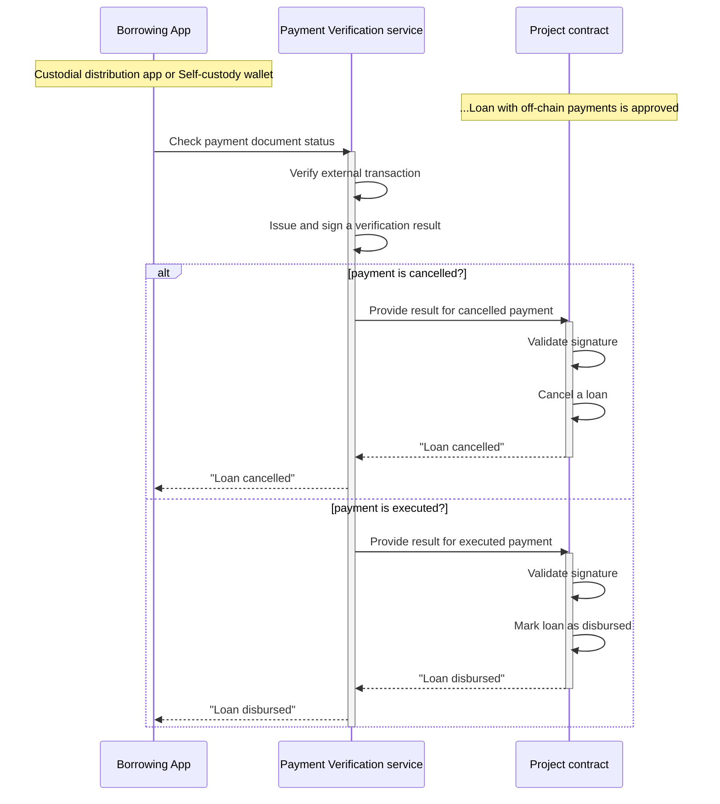

# Loan Disbursement

Loans can be disbursed in two ways depending on the *payment model* parameter of the project. 

## On-chain Disbursement

In the *on-chain* payment model, the disbursement transaction is executed on-chain immediately after loan creation (as part of the Loan Approval process).

## Off-chain Disbursement

In the *off-chain* payment model, the disbursement transaction is settled by a traditional payment provider (payment processor) and it is recorded in the protocol after the *payment verification service* issue a "proof-of-pay" credential.

Below is a diagram that describes the process:

The *payment verification service* performs the verification of an external financial transaction. Depending on the payment channel, the verification may include one of the following:

- Confirming the existence of a blockchain transaction in another protocol
- Check payment document status through an integration with an invoice validation service
- Check transaction status through integration with a payment processor (a card provider or a bank)

