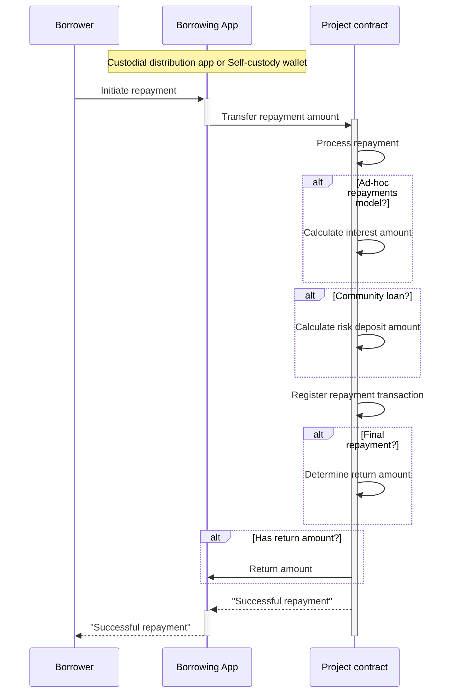
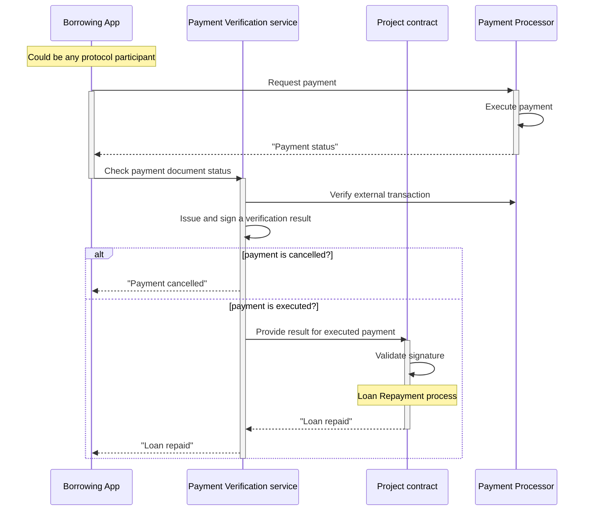

# Loan Repayment

The loan repayment process depends on several project parameters:
- *Payment Model:* On-chain/Off-chain
- *Community Model:* Yes/No
- *Repayment model:* Fixed monthly schedule / Ad-hoc

In the *on-chain* payment model, the repayment transaction is executed on-chain through a transfer between the borrower and the project smart contract. In the *off-chain* payment model, the repayment transaction is settled by a traditional payment provider (payment processor) and it is recorded in the protocol after the *payment verification service* issue a "proof-of-pay" credential.

If the loan is *individual* (community model = no), each borrower repays only his/her loan(s) and any unpaid loans in the project remain in default. If the loan follows the *community model*, the unpaid loans are compensated by additional risk deposits, collected on top of the repaid loans.

If the loan has a *fixed repayment plan* the interest amount is predefined and the repayment amount (principal + interest) is split into several monthly installments. If the loan has a flexible *ad-hoc repayment* model, then the interest amount is a variable calculated based on the period between disbursement and repayment.

## On-chain Repayment

Below is a diagram that describes the process:

For loans with a *fixed repayment plan*, the *Project smart contract* performs the following processing:

- If repaid amount = installment amount -> normal installment repayment
- If repaid amount < installment amount -> partial installment repayment
- If repaid amount > installment amount -> normal + partial installment repayment
- If repaid amount = remaining loan amount -> final loan repayment
- If repaid amount > remaining loan amount -> final loan repayment + overpaid amount (amount for return)
  
For loans with a flexible *ad-hoc repayment* model, the *Project smart contract* first calculates the accrued interest amount before performing the processing steps above:

- Interest amount = Principal (disbursed amount) * APR % * Duration in days / 360
- Installment amount = Principal + Interest amount

For *community loans*, the *Project smart contract* calculates and holds a deposit risk amount:

- Deposit risk amount = Principal * Risk deposit rate %

For loans with a *cash-back* incentive that are fully repaid on-time, the *Project smart contract* calculates the cash-back reward:

- Cash-back reward = Principal * Cash-back rate %

In case the Borrower qualifies for a cash-back payment, the *Project smart contract* repays the amount to the *borrower*. Alternatively, to promote better financial discipline, this cash-back amount can be time-locked and used as a verifiable credential in further loan applications.

## Off-chain Repayment

In the *off-chain* payment model, the repayment transaction is settled by a traditional payment provider (payment processor) and it is recorded in the protocol after the *payment verification service* issue a "proof-of-pay" credential.

Below is a diagram that describes the process:

## Loan Book

*Project smart contracts* are responsible to keep track of the entire loan history. The contracts hold a chain of encrypted "repayment commitments" registered with each disbursement and repayment transaction.

Each record in the loan book contains information about the borrower's SSCR address, Loan Id, accrued commitment and due date. When a *borrower* repays part of the loan, the record is marked as expired/invalid and a new record with updated information is registered in the book. When a *borrower* fully repays the loan, the last record is invalidated and no new commitment record is registered. 

Expired commitment records in the book will be indicators of positive repayment history. Valid (active) commitment records with a due date in the past will be indicators of overdue loans. Since all *Project smart contracts* use the same loan book structure, the latter can be used to determine the entire credit history of a given *borrower*.
  
The data stored in the loan book does not contain any personal data and is encrypted in a way that only the key owner of the SSCR address (the *borrower*) can decrypt his/her credit history.

