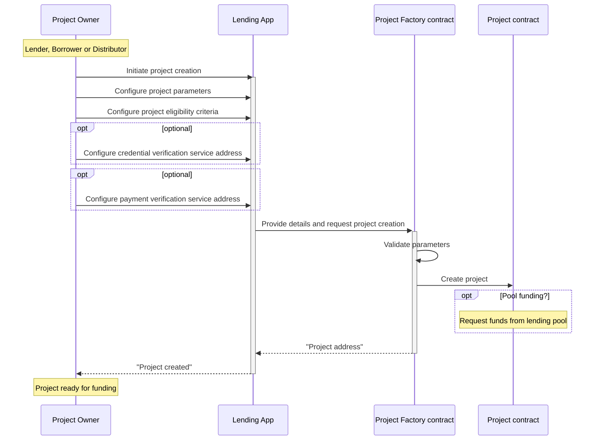

# Project Setup

## Process

A key component in Growr protocol is the lending *project*. The project represents a loan offer with predefined conditions and eligibility criteria and every loan in the protocol is approved and disbursed through a project. 

Each project can be initiated by a *lender*, a *borrower* or by a *distributor* on behalf of borrowers. The initiator becomes a project owner. 

Each project defines a set of verifiable credentials, required from the *borrowers* to get an uncollateralized loan. Some projects might require partial collateral, collected as risk deposit payments from all project borrowers.

The diagram below illustrates the process of project creation and setup:

## Project Parameters

The parameters for project creation include:

- *Owner:* Address of the wallet that controls the project
- *Name:* Descriptive name of the project, used for presentation purposes only
- *Payment Model:* On-chain/Off-chain
- *Currency/Token:* Used when the payment model is "on-chain"
- *Payment Verification Address*: Address of trusted service(s) that provide proof of external financial transactions in case of the "off-chain" payment model
- *Eligibility criteria:* Defines a set of verifiable credentials, requested upon loan application
- *Credential Verification Address:* Address of trusted service(s) that check whether a borrower matches the project's eligibility criteria
- *Limit:* Defines the total project amount available for disbursement
- *Min & max loan amount:* Could be fixed or formula depending on the borrower's credentials
- *Min & max loan duration:* Fixed upon creation
- *Annual interest rate:* Determines the price of the loan
- *Disbursement fee:* Optional fee
- *Community Model:* Yes/No
- *Risk deposit rate:* Applicable for community loans and determines the price of the shared risk
- *Cash-back rate:* Incentive for on-time loan repayment
- *Repayment model:* Fixed monthly schedule / Ad-hoc
- *Pool funding:* Yes/No
- *Pool address:* Address of a lending pool, from which the project will request funding
- *Leverage factor:* Used only for projects funded through lending pools

Once created, project parameters cannot be changed. The only parameter that is subject to a change is the project limit and it could only be increased. In addition, the *Project smart contract* provides a possibility for the owner to stop or pause the lending operations within the project i.e. to permanently or temporarily block future loan approvals.

