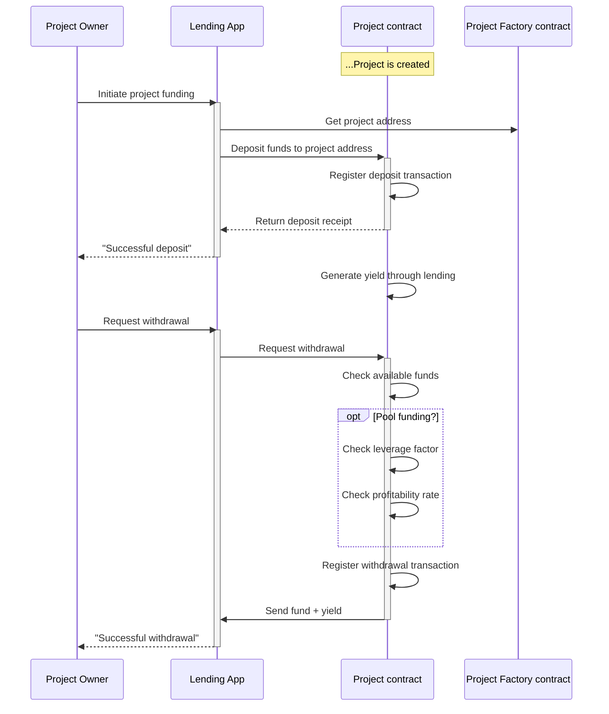
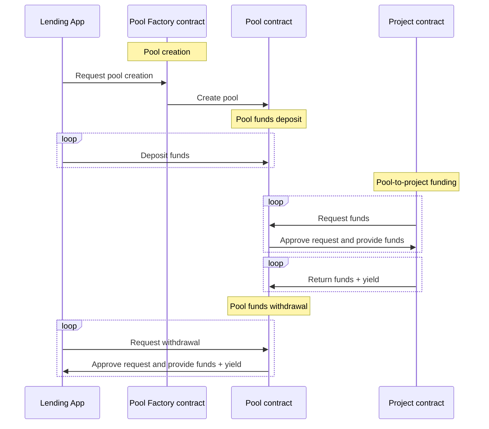
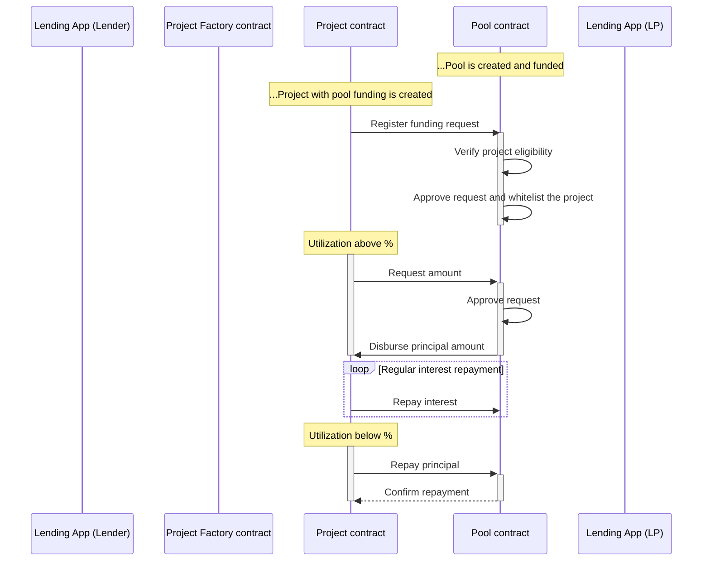

# Project Funding

Projects are funded by their owners who provide the first-loss capital, as well as by *investors* who provide additional senior tranches.

Projects can be funded in several ways depending on 2 project parameters:
- *Payment Model:* On-chain/Off-chain
- *Pool funding:* Yes/No

In the *on-chain* payment model, all transactions for depositing and withdrawing project funds are executed on-chain and processed by the protocol. In the *off-chain* payment approach, project funds are only declared by the project owner but all transactions are executed off-chain. 

If the *pool funding* parameter is activated for a given project, it enables the project to receive additional liquidity (senior tranches) from an automated lending pool. 

## Direct funding (On-chain junior tranches)

Junior tranches are always provided by the owner of the project. Available project funds (non-utilized amount or generated yield) can also be withdrawn only by the project owner. Below is a diagram that describes the process:

## Lending pools (On-chain senior tranches)

Projects with activated *pool funding* can apply for funds from a global lending pool resulting in so-called "contract-to-contract (C2C) lending". Each lending pool combines projects with similar risk levels and financing parameters. 

Below is a high-level diagram that depicts the lifecycle of the lending pools:

The process for *pool creation* is very similar to the process for project creation. The parameters for pool creation include:

- *Owner:* Address of the wallet that controls the pool
- *Name:* Descriptive name of the pool, used for presentation purposes only
- *Currency/Token*
- *Funding criteria:* Defines a set of rules, required for approval of a project (can contain a predefined value or a value range restricting any of the project parameters)
- *Limit:* Defines the total pool amount available for project funding
- *Min & max project amount:* Could be fixed or formula depending on the project's parameters
- *Annual interest rate:* Determines the price of the loan

Once created, pool parameters cannot be changed. The only parameter that is subject to change is the pool limit. In addition, the *Pool smart contract* provides a possibility for the owner to stop or pause the lending operations within the pool i.e. to permanently or temporarily block future projects funding.

The processes for *pool deposit and withdrawal* are very similar to the respective processes on the project level.

The process for *pool-to-project funding* is presented in more detail in the next diagram:

If a project owner considers using liquidity from a global lending pool, he must activate the pool funding during project setup. He must also configure the pool's address so the newly created *Project smart contract* will automatically register a funding request on the *Pool smart contract*.

The *Pool smart contract* verifies the project parameters and approves the request by whitelisting the project address.

Based on the project utilization, the *Project smart contract* can automatically apply for funds to the *Pool smart contract*. The approved funds have 2 limits - the first one is defined as a parameter of the pool and the second one is a formula (Project Balance * Leverage Factor). 

The *project* is required to regularly repay the interest amount to the *pool*. Depending on the configured utilization threshold, the *project* can also partially or fully repay the principal to the *pool*.

This process ensures automatic liquidity management between the *Pool smart contract* and the whitelisted *Project smart contracts*.

