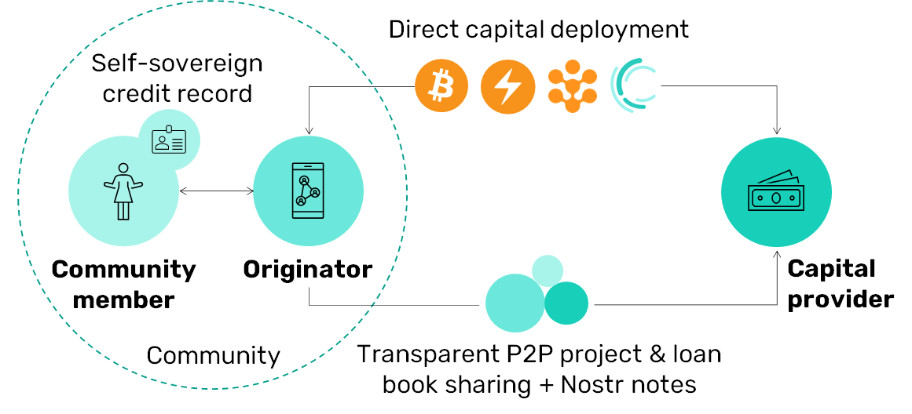

# Introduction

## Overview

_Growr protocol_ is an open-source peer-to-peer protocol that enables access to fair financing. The protocol helps micro-entrepreneurs from local communities to receive instant productive loans based on their self-sovereign credit record without the need for over-collateralization. In contrast to traditional microfinance, the protocol creates an open and global lending marketplace that connects borrowers to both traditional and decentralized capital providers, enforcing fair competition for pricing and fully transparent deployment of capital down to each micro-loan.

The following diagram provides a high-level overview of Growr protocol.

Originators manage the “last-mile” processes through their Growr node. They help community members to build their self-sovereign credit record and facilitate the access to the protocol services & project funding for them.

Capital providers fund projects either by accessing the Growr node of an originator directly, or by running their own node. The P2P data exchange enables real-time reporting of the project portfolio for full transparency.

Currently, we have designed 4 main groups of protocol processes:

- Setup
- Lending
- Funding
- Crowdfunding

