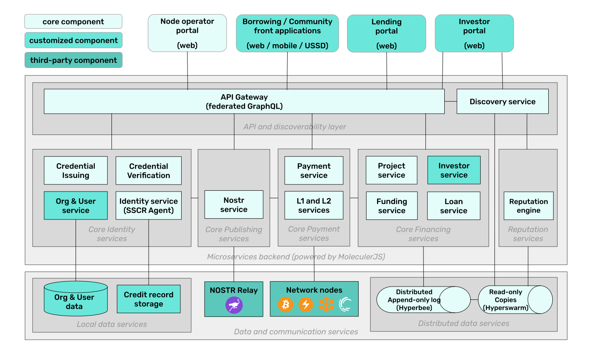

## Growr protocol components

### Overview

Below is a high-level overview of Growr protocol architecture:

_Growr protocol_ implements a global decentralized micro-lending marketplace as a P2P network of Growr nodes. Each _Growr node_ represents a package of open-source components and a set of lending projects. It enables originators to publish projects with predefined conditions and eligibility criteria, and borrowers to apply and get financing using credentials from their self-sovereign credit record. It also enables capital providers to fund projects either by accessing the Growr node of an originator directly, or by running their own node.

### Front-end applications

- Node operator portal
- Lending portal
- Investor portal
- Borrowing applications

### Core services

Identity services:

- Organization service
- User service
- Identity service (SSCR)
- Credential issuing service
- Credential verification service

Financing services:

- Project service
- Loan service
- Lending events service
- Investor service
- Funding service

Payment services:

- Payment service
- Bitcoin service
- Lightning service
- Rootstock service

Publishing services:

- Nostr service

