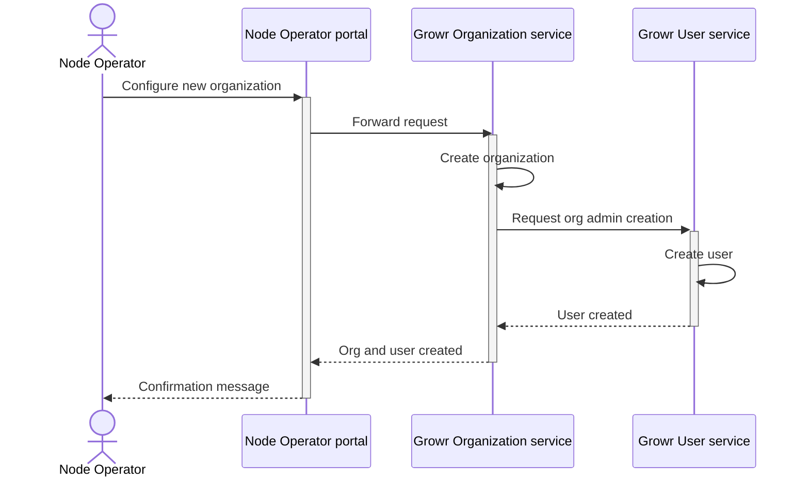

## Growr node deployment

There are 2 main options for Growr node deployment:

- Self-hosted by originators or capital providers
- Managed by the Growr team

### Self-hosting

In progress

### Managed service

In progress

### Organization setup

Once the Growr node is deployed, the first thing to do is to create an organization with one initial user.

Process steps:

1. Growr node operator setups a new organization through the Node Operator portal.
2. The portal routes the request to the Growr Organization service.
3. Growr Organization service creates a new record in the Organizations collection.
4. Growr Organization service sends a request to the Growr User service to create an initial admin user for the new organization.
5. Growr User service creates a new record in the Users collection.

