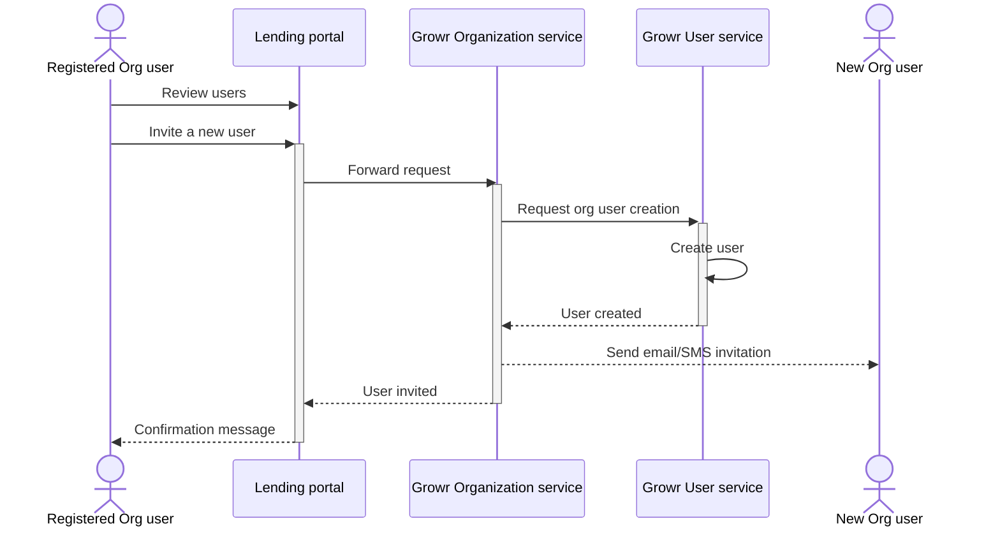
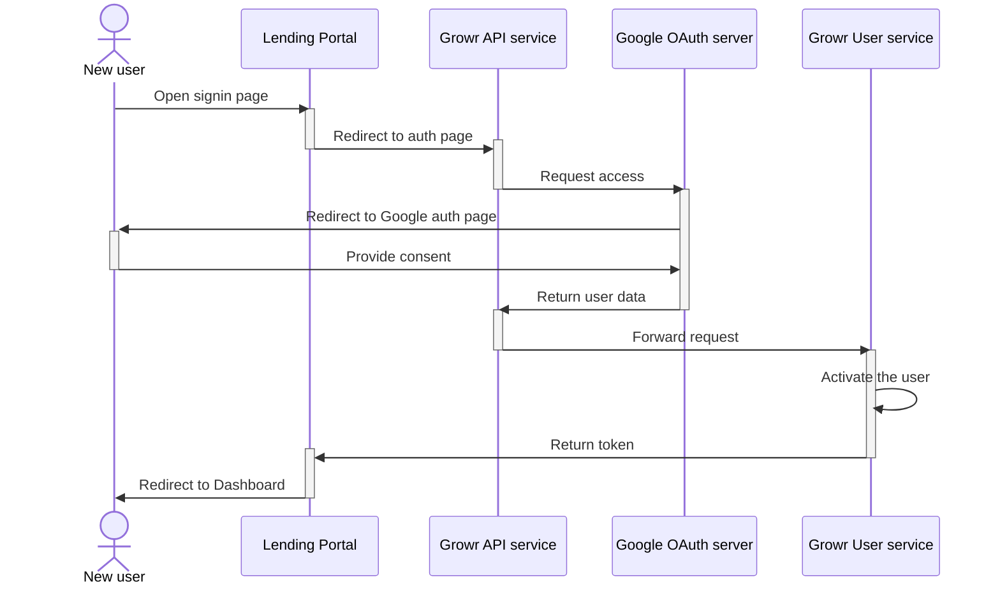
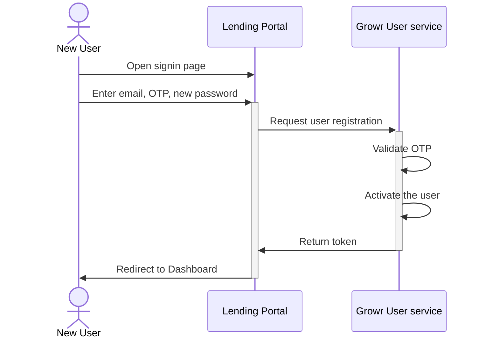
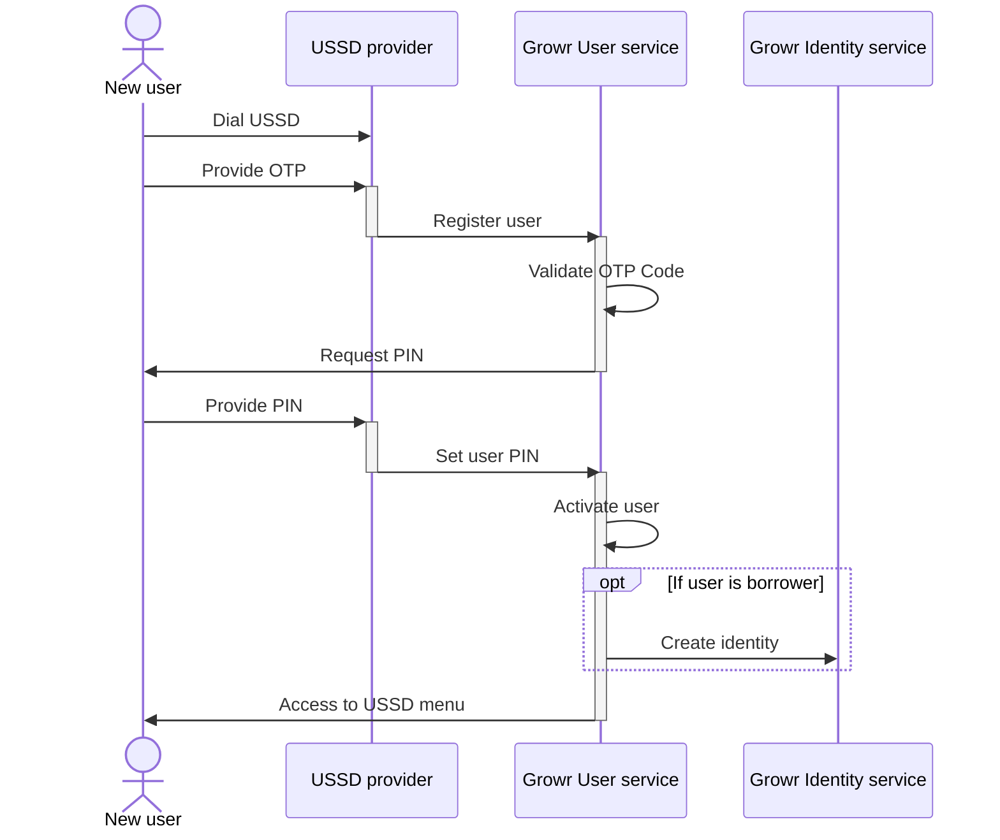
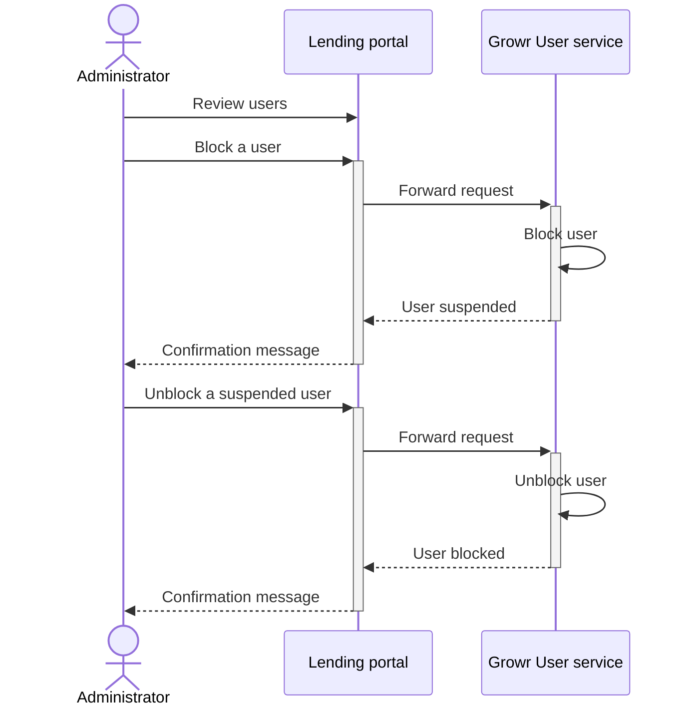

## User setup

Currently, Growr User service supports 5 type of users:

- _Node operator (super-admin):_ manages growr node configuration.
- _Originator admin:_ manages projects, lending and funding parameters, monitors the performance.
- _Originator agent:_ manages operations with the borrowers.
- _Investor:_ discovers and invests in projects.
- _Borrower:_ onboards and subscribes for lending services.

### User invitation

In order for a user to be registered, one of the following prerequisites must be met:

- The user is created by the Node operator during organization setup.
- The user is invited by an originator admin.

Process steps:

1. A registered user reviews the list of users in the Lending portal.
2. The user configures a new user.
3. The portal routes the request to Growr Organization service.
4. Growr Organization service sends a request to Growr User service to create a new user related to the organization.
5. Growr User service creates a new record record in Users collection.
6. Response message.
7. Growr Organization service sends an invitation email with link to the Lending portal and (optional) OTP code.

### User registration

Currently, Growr User service supports 3 types of registration:

- Social account (Google, Facebook): applicable to users with type _Originator admin_ and _Investor_
- Email + password: applicable to users with type _Originator admin_ and _Investor_
- Phone: applicable to users with type _Originator agent_ and _Borrower_

### User registration with Social account

Prerequisite: User has received an invitation email.

Process steps:

1. An invited user opens the Lending portal and is automatically redirected to the /signup page where the user initiates the signup process.
2. The Lending portal redirects the user to the authentication route of Growr API service.
3. Growr API service calls the Google authentication API.
4. Google authentication server redirects the user to the authentication page.
5. The user selects one of his available Google accounts and provides the requested consent.
6. Google authentication server confirms the authentication and returns the user data to Growr API service.
7. Growr API service redirects the request to Growr User service.
8. Growr User service updates the record (changes the status to ACTIVE) in the Users collection.
9. Growr User service returns a token to the Lending Portal. The token will be used for all subsequent calls to Growr services.
10. The Lending portal lets the user in and redirects him/her to the main page (Dashboard).

### User registration with email and password

Prerequisite: User has received an invitation email with OTP code.

Process steps:

1. An invited user opens the Lending portal and is automatically redirected to the /signup page where the user initiates the signup process.
2. The user enters his email (where an invitation was received), the received OTP code and configures a new password.
3. The Lending portal sends a request for registration of the new user with his/her email and password.
4. Growr User service validates the provided OTP code.
5. Growr User service updates the record (changes the status to ACTIVE) in the Users collection.
6. Growr User service returns a token to the Lending Portal. The token will be used for all subsequent calls to Growr services.
7. The Lending portal lets the user in and redirects him/her to the main page (Dashboard).

### User registration with phone

Prerequisite: User has received an invitation SMS with OTP code.

Process steps:

1. An invited user dials a number to receive a USSD menu.
2. The user provides the OTP code that was received as an SMS.
3. The USSD provider sends a request for registration of the new user with phone.
4. Growr User service validates the provided OTP code.
5. Growr User service requests a PIN to be provided by the user.
6. The user enters and confirms a PIN using the USSD menu.
7. The USSD provider sends a request for PIN setting to Growr User service.
8. Growr User service registers the PIN and updates the record (changes the status to ACTIVE) in the Users collection.
9. Growr User service requests from Growr Identity service to create an SSCR identifier (DID) and a private key.
10. The user is authorized to access the full USSD menu options.

### Suspending users

Administrators (admins and/or super-admins) can temporarily block other users to prevent them from using the node services.

Process steps:

1. An administrator reviews the list of users registered in the node.
2. The user selects a given user from the list and requests its suspension.
3. The Lending portal sends the suspension request.
4. Growr User service updates the record (changes the status to BLOCKED) in the Users collection.
5. Response message.
6. Response message.

The steps for unblocking the user (i.e. removing his/her suspension) are the same.

