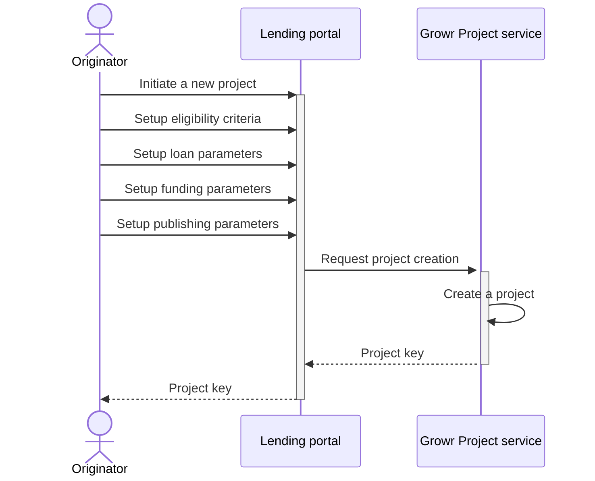
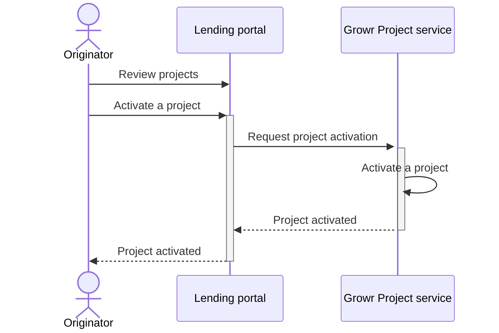

## Project setup

A key component in the Growr protocol is the lending _project_. The project represents a loan offer with predefined conditions and eligibility criteria. Every loan in the protocol is approved and disbursed through a project. In addition, the project determines the funding needs and the potential investment channels. Projects are usually initiated by originators on behalf of their borrowers.

### Project creation

Process steps:

1. An originator admin creates a new project for lending service in the Lending portal.
2. The user configures the eligibility criteria for approval of loans from the project.
3. The user configures the parameters of the loan.
4. The user configures one or more funding sources for the project.
5. The user configures a description and media parameters of the project.
6. The request is transferred from the Lending portal to the Growr Project service.
7. Growr Project service creates a new project in the Projects book.
8. Response message.
9. Response message.

### Project activation

Once a project is created, it must be activated to become operational. Once a project is activated, the following processes are unlocked:

- The lending service from the project becomes active i.e. new loan applications are accepted.
- The project becomes discoverable (in case the project is public).
- The project funding wallet is created and an on-chain listener is registered on the network (in case the project has one or more configured on-chain funding sources).

After a project is activated, it can be temporarily deactivated. This status pauses the lending service i.e. new loan applications will not be accepted until the project is activated again.

Process steps:

1. An originator admin reviews the projects in the Lending Portal.
2. The user selects a project in status DRAFT and activates it.
3. The request is transferred from the Lending portal to the Growr Project service.
4. Growr Project service activates the project.
5. Response message.
6. Response message.

The steps for project deactivation are the same.

