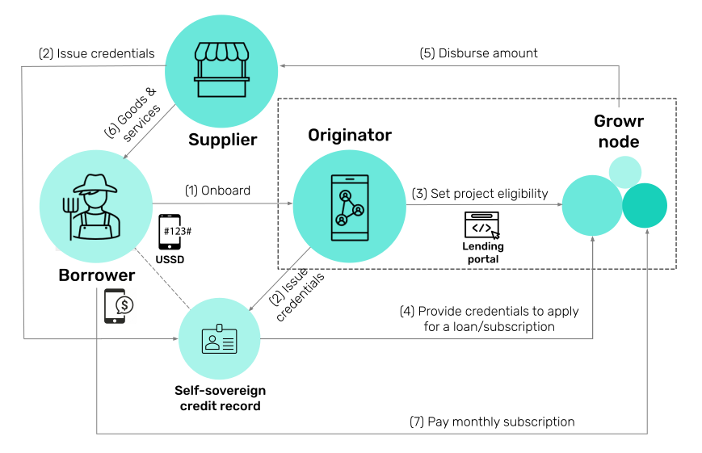

# Lending

## Overview

Below is a diagram that summarizes the lending processes:

1. The _borrower_ is onboarded on a platform, provided by an _originator_ (such as a cooperative, guild, wholesale buyer, digital wallet, or another provider), where the borrower defines their funding needs.
2. One or more _trusted parties_, such as merchants of suppliers, provide credentials to the _borrower_ to start building their self-sovereign credit record.
3. The _originator_ creates a project with details about the local activities and the financing needs of the _borrowers_.
4. _Borrowers_ go through a simple application process to receive a loan after asserting their eligibility with their verifiable credentials.
5. The disbursed amount is received by the _borrowers_ in the borrowing application or directly paid to a _third party_, such as a merchant or a supplier.
6. The _third party_ provides the necessary goods and services to the _borrower_ to achieve their goals.
7. Depending on their business activity and the agreed lending conditions, the _borrowers_ repay their loans on a regular basis or as a bullet payment at the end of the season.

The next sections describes the following processes:

- Borrower onboarding
- Loan application
- Loan utilization
- Loan repayment

