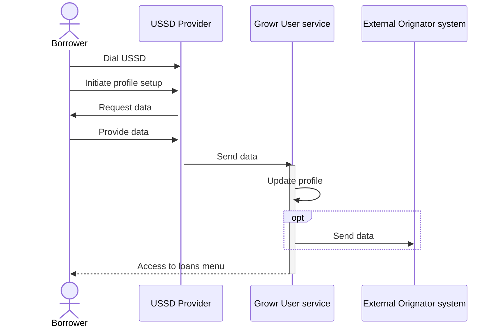
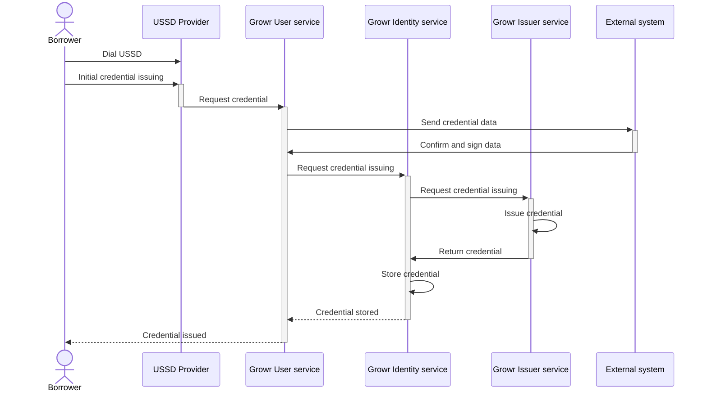

## Borrower onboarding

The Growr protocol does not enforce any specific requirements upon onboarding implementation, so developers may design features and functionalities that correspond to the desired user experience.

In a custodial model, the borrowers would onboard using a mobile or web application, or even a USSD interface, provided by an originator. The originator is responsible for onboarding the users into their application and facilitating their access to the protocol. The private keys of the user DID and wallets are managed by the originator's app.

In a non-custodial model, the borrowers would use a borrowing dApp to create and manage their self-custody wallet, then claim credentials and apply for a loan from the protocol without involving a third party.

The processes in the following sections illustrate a scenario with a custodial application with a USSD interface.

### Borrower registration

See [User registration](#ref-2-3-ur)

### Borrower profile setup with a phone

Process steps:

1. A borrower dials a number to receive a USSD menu.
2. The user selects the "profile setup" option from the menu.
3. The USSD shows a series of screens, prompting the borrower to provide information about him/her and his/her activities.
4. The borrower provides the requested data.
5. The USSD provider sends the data to the Growr User service.
6. Growr User service updates the record in the Users collection by adding the collected information.
7. Optionally, the Growr User service sends the data to an external Originator system (eg. a scoring system).
8. The borrower is now authorized to access the "loans" option from the menu.

### Credential issuing with a phone

Process steps:

1. A borrower dials a number to receive a USSD menu.
2. The user selects the "credentials" option from the menu and selects data attributes with a proven source.
3. The USSD provider sends the request to Growr User service.
4. Growr User service sends the credential data to a trusted external system.
5. The external system verifies the data, signs it and returns the signed data back to Growr User service.
6. Growr User service initiates credential issuing.
7. Growr Identity service requests credential issuing from the Growr Issuing service.
8. Growr Issuing service issues the verifiable credential.
9. Growr Issuing service returns the credential to the Growr Identity service.
10. Growr Identity service stores the issued verifiable credential in the borrower's SSCR.
11. Growr Identity service confirms that the credential is issued and stored securely.
12. Growr User service sends an SMS notification to the borrower.

