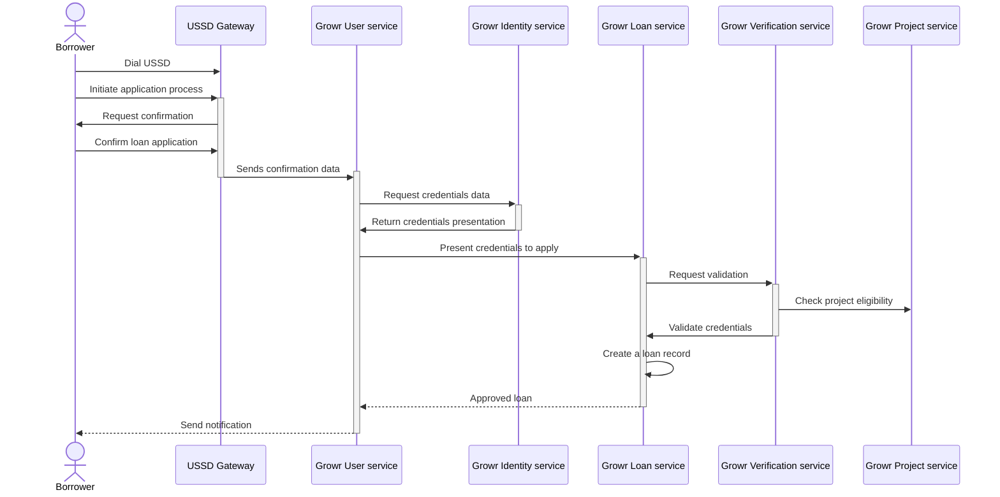

## Loan application

### Loan application with phone

Process steps:

1. A borrower dials a number to receive a USSD menu.
2. The user selects the "loan application" option from the menu.
3. The USSD shows the terms and conditions of the loan and prompts the borrower to provide confirmation.
4. The borrower confirms the loan application.
5. The USSD provider sends the data to Growr User service.
6. Growr User service requests verifiable credentials stored in borrower’s Growr SSCR agent.
7. Growr Identity service creates a credential presentation and returns it to Growr User service.
8. Growr User service presents the credentials in front of Growr Loan service to apply for a loan.
9. Growr Loan service requests credentials validation from Growr Verification service.
10. Growr Verification service reads the project eligibility criteria from Growr Project service.
11. Growr Verification service validates the credentials and verifies the eligibility of the farmer in front of Growr loan service.
12. Growr Loan service creates a new record in protocol’s Loans book.
13. Growr Loan service confirms that the loan is approved and created.
14. Growr User service sends an SMS notification to the borrower.

