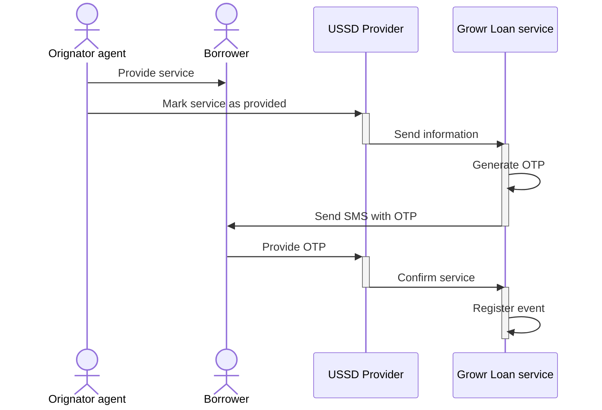

## Loan utilization

### Loan disbursement

In progress

### Service tracking with phone

Process steps:

1. An agent from the originator (or from a local service provider) provides the service/good, for which the borrower applied for.
2. The agent marks the service as successfully provided using a USSD interface.
3. The USSD provider sends the information to Growr loan service.
4. Growr Loan service generates an OTP code.
5. Growr Loan service sends an SMS with the code to the borrower.
6. The borrower browses the USSD menu and enters the received OTP code.
7. The USSD provider sends the confirmation to Growr Loan service.
8. Growr Loan service registers the event in the internal Loan Event book.

