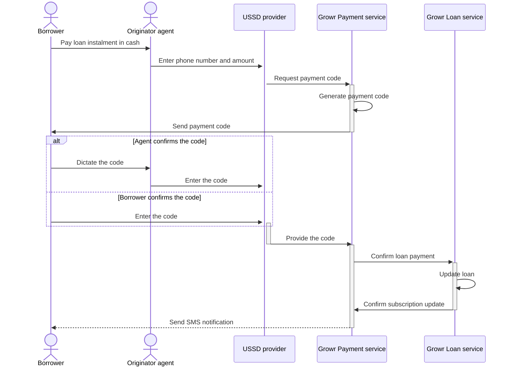
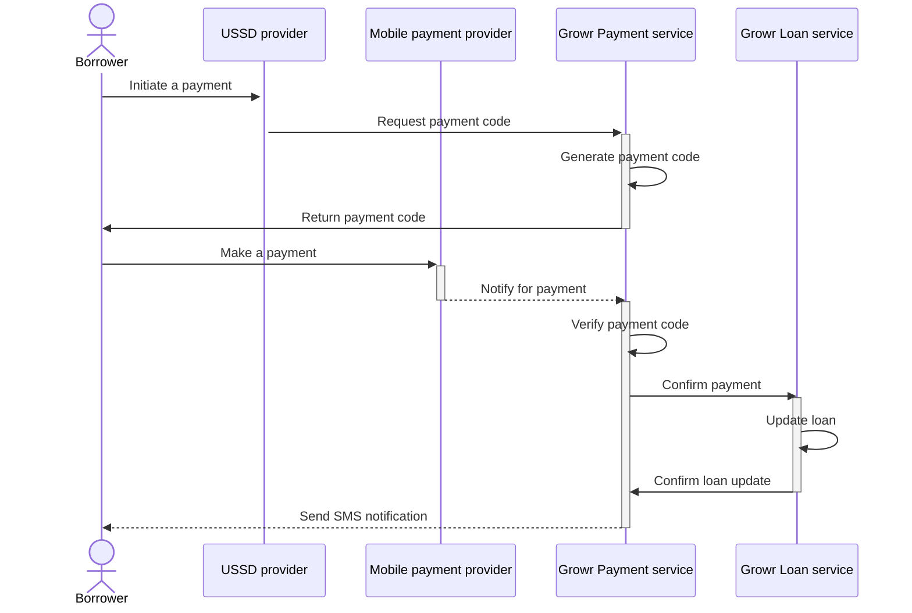

## Loan repayment

### Cash payment

Process steps:

1. An originator agent visits a borrower and reminds about an upcoming loan payment. The borrower pays the amount in cash to the agent.
2. The agent registers the payment by entering borrower’s phone number and paid amount through a specific USSD menu.
3. The USSD provider sends the request to Growr Payment service.
4. Growr Payment service generates a unique OTP code for the respective loan payment.
5. Growr Payment service sends an SMS with the OTP code to the borrower.
6. The borrower dictates the code to the agent.
7. The agent enters the code to verify the transaction.
8. Alternatively, the borrower enters the code by himself.
9. The USSD provider sends the confirmed code to Growr Payment service.
10. Growr Payment service verifies the code and asserts the payment in front of Growr Loan service.
11. Growr Loan service registers the payment event and updates the loan - respectively increase the paid amount and decrease the due amount.
12. Growr Loan service returns a confirmation to Growr Payment service.
13. Growr Payment service sends an SMS notification to the borrower.

### Mobile payment

Process steps:

1. According to the loan repayment schedule, a borrower initiates a payment request from the respective USSD menu.
2. The USSD provider sends the request to Growr Payment service.
3. Growr Payment service generates a unique code (with a predefined prefix) for the respective loan payment.
4. Growr Payment service sends an SMS with the payment code to the borrower.
5. Using the provided code, the borrower makes a payment using his Mobile Money wallet.
6. The Mobile payment provider detects a payment with the given prefix and notifies Growr Payment service about the transaction.
7. Growr Payment service verifies the payment code from the transaction.
8. Growr Payment service asserts the payment in front of Growr Loan service.
9. Growr Loan service registers the payment event and updates the loan.
10. Growr Loan service returns a confirmation to Growr Payment service.
11. Growr Payment service sends an SMS notification to the borrower.

### Onchain payment

In progress

