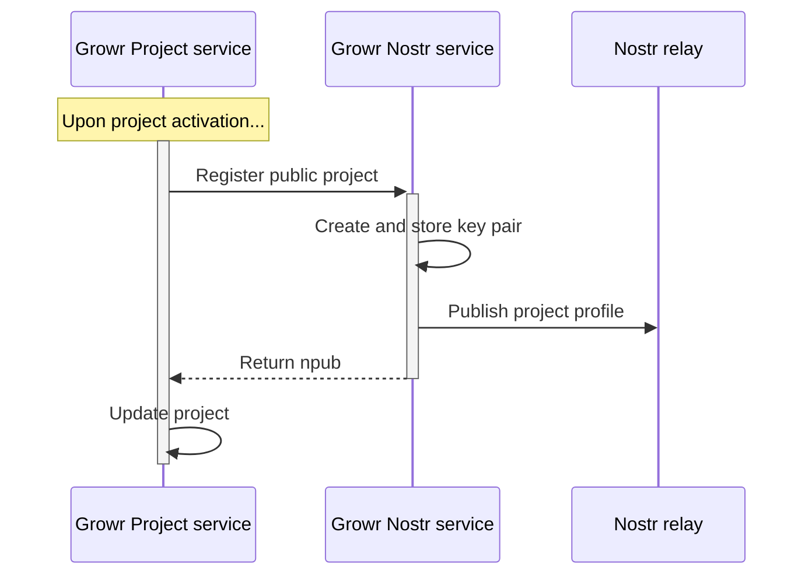
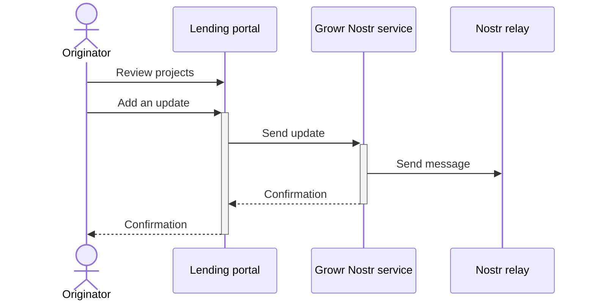

## Project discovery

### Project publishing

Process steps:

1. Growr Project service sends information to Growr Nostr service about a new public project.
2. Growr Nostr service generates a new pair of public-private keys and stores them securely.
3. Growr Nostr service publishes a Nostr profile for the project through a Nostr relay.
4. Growr Nostr service returns the npub of the Nostr profile.
5. Growr Project service stores the npub address and updates the record of the respective project in the Project book.

### Project feed

Process steps:

1. An originator reviews the projects in the Lending portal and selects one (that is public).
2. The originator enters a new message with a description of the project status or achievements.
3. The Lending portal sends the information to Growr Nostr service.
4. Growr Nostr service posts a message to the project's Nostr profile through a Nostr relay.
5. Response message.
6. Response message.

### Project discovery

Investors can discover lending projects in 3 ways:

- Review the Nostr profile of a public project.
- Review a public project in the project directory in the Investor portal.
- Review a non-public project in the Investor portal after he/she has been invited as an investor to this project.

