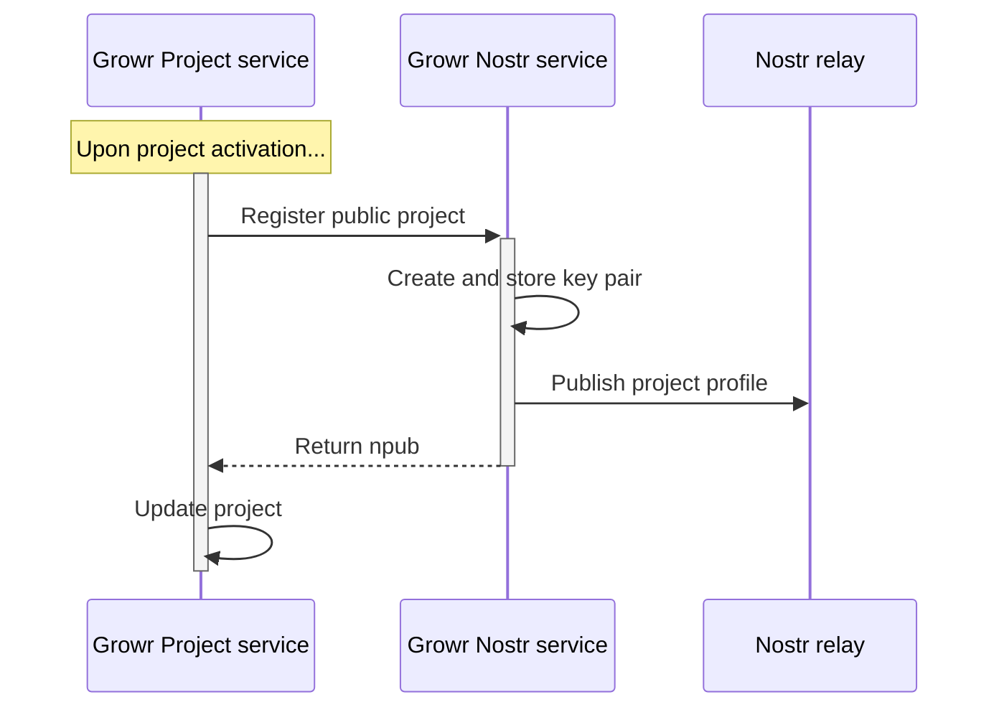

## Project discovery

### Project publishing



Process steps:

1. Growr Project service sends information to Growr Nostr service about a new public project.
2. Growr Nostr service generates a new pair public-private keys and stores it securely.
3. Growr Nostr service publishes a Nostr profile for the project through a Nostr relay.
4. Growr Nostr service returns the npub of the Nostr profile.
5. Growr Project service stores the npub address and updates the record of the respective project in the Project book.

### Project feed

```mermaid

```

Process steps:

1. TBD

### Project discovery

```mermaid

```

Process steps:

1. TBD

<div style="page-break-after: always;"></div>
