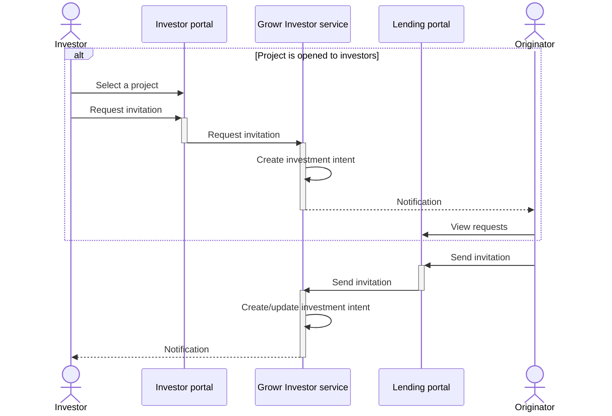
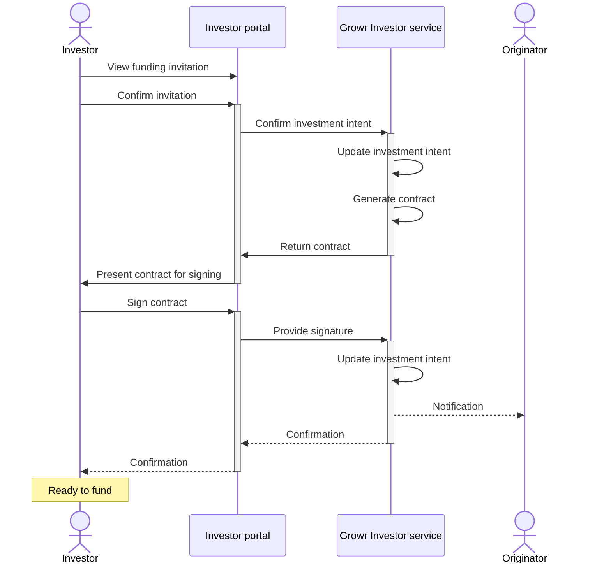

## Investor onboarding

### Investor registration

See [User registration](#ref-2-3-ur)

### Project funding invitation

Process steps:

1. An investor reviews the projects through the Investor portal and selects one that is opened for investment.
2. The investor requests funding invitation for the selected project.
3. The Investor portal sends the request to Growr Investor service.
4. Growr Project investor service registers the investment funding intent with status REQUESTED.
5. Growr Project investor service sends an email notification to the originator.
6. An originator admin reviews the funding invitation requests in the Lending portal.
7. The originator sends an invitation for project funding to a given investor (with or without existing invitation request).
8. The Lending portal sends the request to Growr Investor service.
9. Growr Project investor service registers (or update if existing) the investment funding intent with status INVITED.
10. Growr Project investor service sends an email notification to the investor.

### Project funding commitment

Process steps:

1. An investor is invited to fund a project.
2. The investor confirms the funding invitation through the Investor portal, indicating the investment amount, funding source and wallet address.
3. The Investor portal sends the confirmation to Growr Investor service.
4. Growr Project investor service updates the investment intent with status CONFIRMED.
5. Growr Project investor service generates an investment contract between the investor and the originator.
6. Growr Project investor service sends the contract back to the Investor portal.
7. The investor downloads the contract from the Investor portal and reviews it.
8. The investor signs the contract.
9. The Investor portal sends the signed contract together with investor's signature to Growr Project investor service.
10. Growr Project investor service updates the investment funding intent with status SIGNED.
11. Growr Project investor service sends an email notification to the originator.
12. Response message.
13. Response message.

