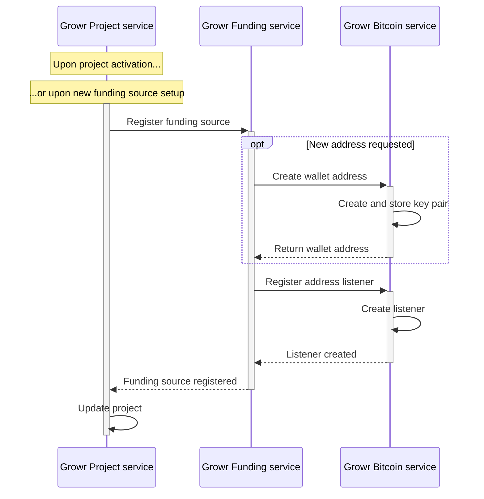
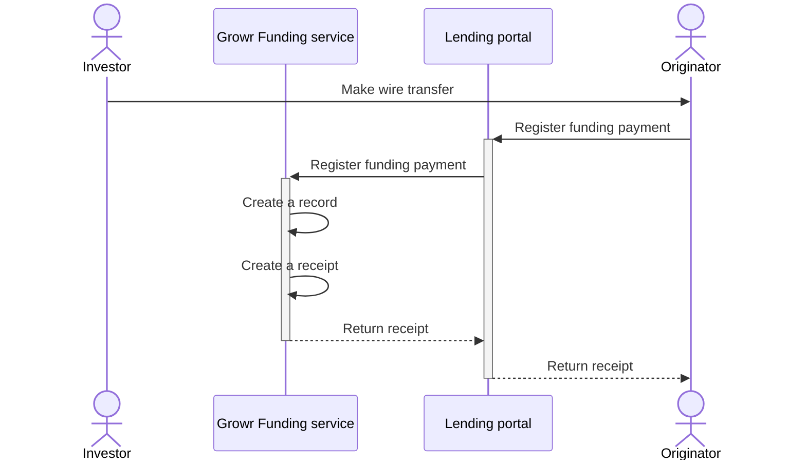
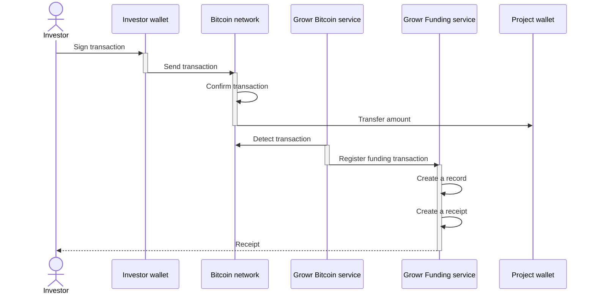
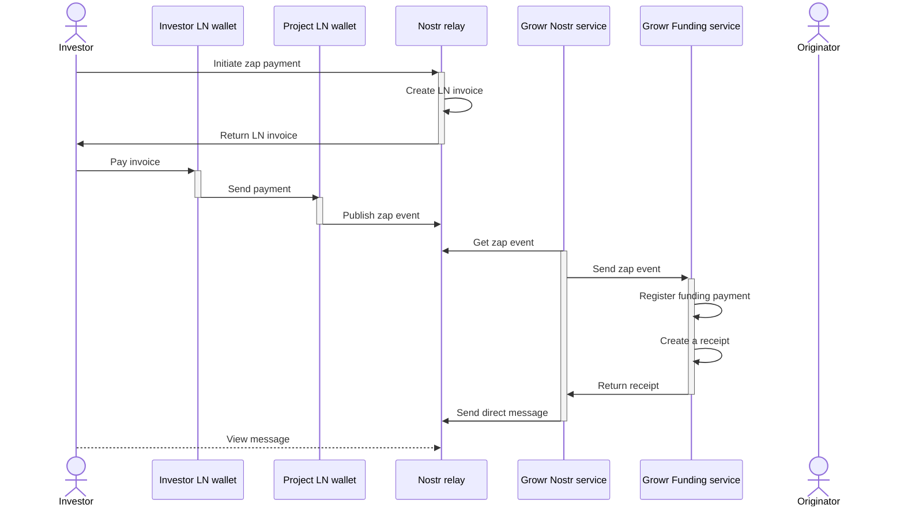

## Project funding

Currently, the Growr protocol supports 4 types of funding sources:

- _Traditional (bank account):_ Growr protocol does not monitor or manage any payments; they are executed “off-chain” and registered in the system by the originator.
- _Digital (on-chain wallet):_ Growr protocol monitors the project wallet and automatically tracks all investments and repayments.
- _Digital (multi-sig wallet):_ Growr protocol creates a multi-sig wallet, in which the investor transfers digital assets. To claim the money from the wallet, the originator signs a loan agreement.
- _Crowdfunding:_ Growr protocol supports bitcoin crowdfunding leveraging Lightning Network as a payment rail and Nostr as a message exchange. Crowdfunded projects have a Nostr profile and multiple investors can fund them via zap messages in Nostr.

### Funding setup

Process steps:

1. Growr Project service sends information to Growr Funding service about a new funding source.
2. Growr Funding service requests the creation of a new Bitcoin address for the project.
3. Growr Bitcoin service generates a new pair of public-private keys and stores them securely.
4. Growr Bitcoin service returns the new wallet address to the Growr Funding service.
5. Growr Funding service requests the creation of a new on-chain listener.
6. Growr Bitcoin service registers a new listener that will detect all transactions to the project wallet address.
7. Growr Bitcoin service returns confirmation.
8. Growr Funding service returns confirmation and information about the newly created wallet address.
9. Growr Project service stores the new wallet address and updates the record of the respective project in the Project book.

### Project funding with a bank account

Process steps:

1. An already onboarded investor makes a wire transfer to a bank account, created for the project.
2. Upon receiving the transfer, the originator of the respective project registers the received investment through the Lending portal.
3. The Lending portal sends the information to the Growr Funding service.
4. Growr Funding service creates a new record in the Funding book.
5. Growr Funding service creates a receipt for the investment with a signature on behalf of the originator.
6. Growr Funding service returns the receipt to the Lending portal.
7. The Lending portal presents the receipt to the investor.

### Project funding with an on-chain wallet

Process steps:

1. An already onboarded investor signs an on-chain transaction using his Bitcoin wallet.
2. The investor's wallet sends the transaction to the Bitcoin network.
3. The transaction is confirmed by the network in the next block.
4. The amount is transferred to the Bitcoin wallet address of the project.
5. Growr Bitcoin service detects an incoming transaction to the project wallet.
6. Growr Bitcoin service sends the information to the Growr Funding service.
7. Growr Funding service creates a new record in the Funding book.
8. Growr Funding service creates a receipt for the investment with a signature on behalf of the originator.
9. Growr Funding service sends an email with an attached receipt to the investor.

The process is the same for projects with funding in Rootstock or Liquid networks.

### Project crowdfunding

Process steps:

1. An investor initiates a zap payment (event kind = 9734) to the project Nostr profile using his Nostr client.
2. The Nostr relay, which includes also an LNURL server, creates a Lightning invoice.
3. The Lightning invoice is presented to the investor.
4. The investor makes a payment to the invoice using his Nostr or Lightning client.
5. Upon paying the invoice, the funds arrive at the Lightning address of the project.
6. A Zap note is created (event kind = 9735) and sent to the Nostr relay.
7. Growr Nostr service listens for new messages on the Project Nostr profile and detects the new Zap event.
8. Growr Nostr service sends the information to the Growr Funding service.
9. Growr Funding service creates a new record in the Funding book.
10. Growr Funding service creates a receipt for the investment with a signature on behalf of the originator.
11. Growr Funding service returns the receipt to Growr Nostr service.
12. Growr Nostr service creates a new direct message (event kind = 4) with an attached receipt.
13. The investor receives the message using his Nostr client.

