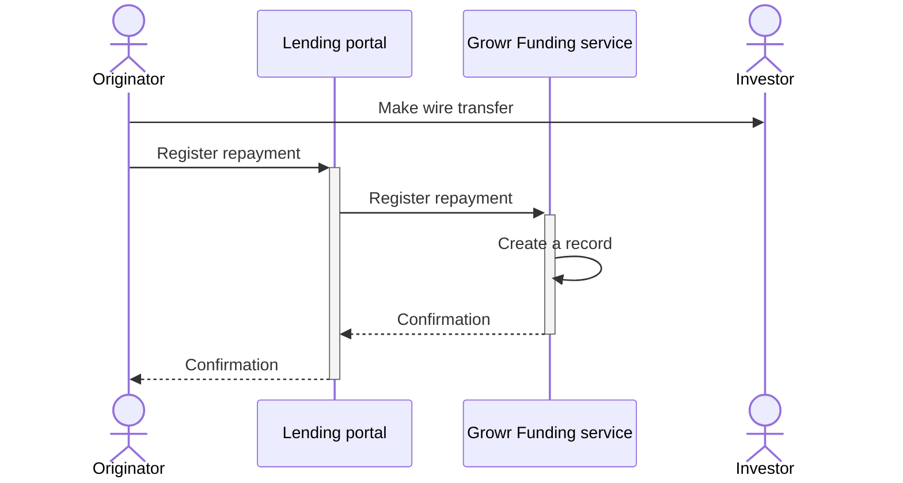
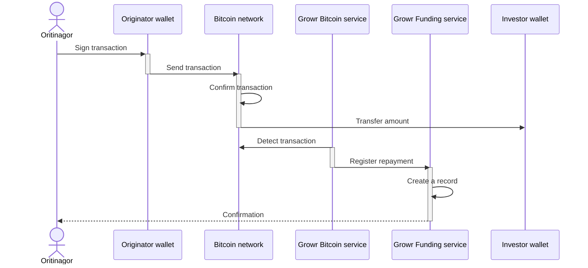

## Project repayment

### Project repayment with bank account

Process steps:

1. According to the agreed repayment plan, an originator makes a wire transfer to the bank account of the investor.
2. The originator also registers the repayment through the Lending portal.
3. The Lending portal sends the information to Growr Funding service.
4. Growr Funding service creates a new record in the Funding book.
5. Response message.
6. Response message.

### Project repayment with onchain wallet

Process steps:

1. An originator signs an onchain transaction using his bitcoin wallet.
2. Originator's wallet sends the transaction to Bitcoin network.
3. The transaction is confirmed by the network in the next block.
4. The amount is transferred to the bitcoin wallet address of the investor.
5. Growr Bitcoin service detects the outgoing transaction.
6. Growr Bitcoin service sends the information to Growr Funding service.
7. Growr Funding service creates a new record in the Funding book.
8. Response message.

