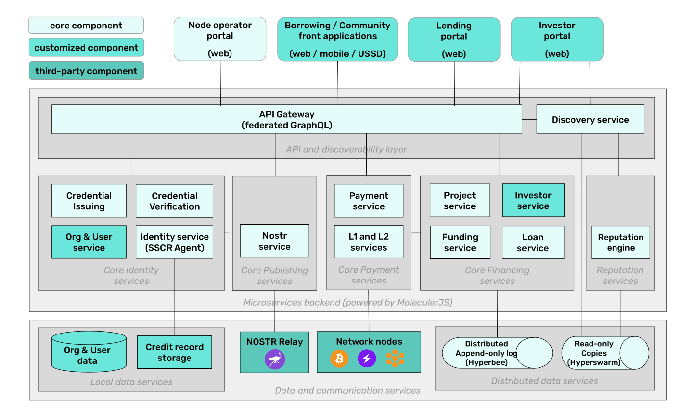

## Architecture components

The following component diagram presents the applications and services, available in Growr node.

At the top of the diagram are the _front-facing applications_. These apps and services are on top of FOSS protocol and services. They can be developed by Growr or other integrators per deployment. The node can be extended with different applications fitting the purpose.

The _backend of Growr node_ consists of a group of services that are maintained as open-source software under an open license but can be extended following the community and product guidelines. All the services in these groups are deployed with proof that the running service has a well-known identity or a public key, and its code is identical to the source code in the Growr repositories.

Growr node relies on 2 types of _data services_:

- _Local data services:_ Database collection that stores editable and manageable data locally in the node.
- _Distributed data services:_ Append-only B-tree logs with read-only copies that are shared and can be discovered by external services by their public key.

