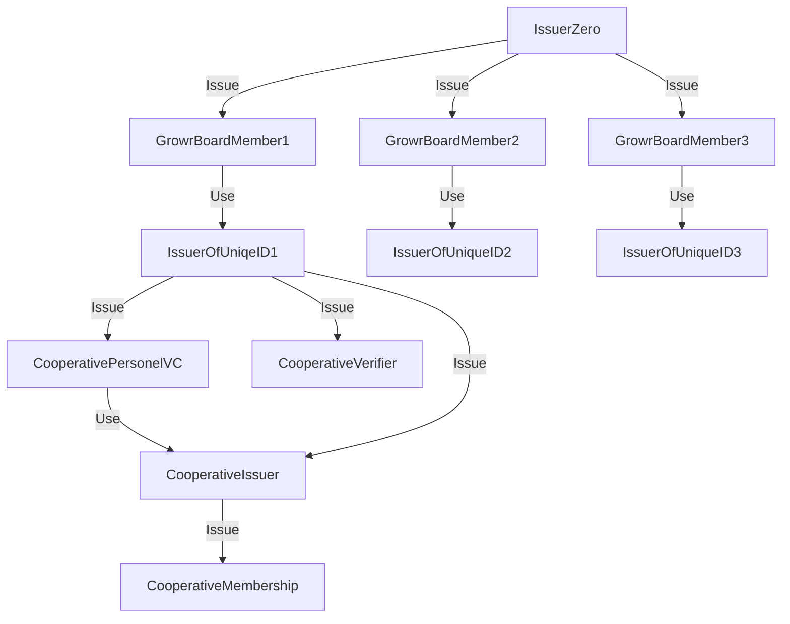

# Governance and protection from Sybil attacks [WIP]

## Token vs tokenless

In the rise of the decentralised communities based on blockchain, striving for working and fair governance, while preserving privacy is not an easy job.

Token-based vote or Governance means whoever has the most tokens, has the strongest voice. In essence this brings the autonomous communities to neo-feudalism (or Founder-Leader model of governance). This might work for rapid evolution and development but on the long run can cause a lot of issues, leading to dispersion of the community.

Another open market based mechanism is quadratic voting. That means basically, that one vote costs 1 token, 2 votes - 4, 3 - 9, etc. This surely would make anyone with strong opinion towards the decision put for vote to invest in making their voice heard. Yet, a wealthier person would easily strive the vote towards a favorable choice. Of course, we can also assign each person same amount of voting tokens and let them vote, using the quadratic voting principles, again, to support what you believe the most.

Yet, if a person owns many personalities, that would mean that the s/he can get much cheaper voting power. 

*If each identity gets one voting power we still have the issue how many identities a person is operating with? Or the so called Sybil attack. *

The Sybil attack is an attack where one user has many identities and is using them to game the system. In Growr case that would be an issue in an attempt of a borrower with bad credit record to create new persona in order to try and get better lending deals or in a governance case, where someone is using Sybil identities to turn the vote into his favor.

What can we do to fight that?

Identity verification is one thing (KYC) but as we know, this is a big red flag in the open communities striving to preserve their participants privacy. Also the KYC data holder becomes a subject of attacks and still might be quite centralised. ZKP VCs is another, but currently rIdentity lacks that. *Maybe we can try to get new Identity roadmap from Lancen?* Last, but not the least, many of the unbanked lack IDs to be verified through KYC.

One of the promising of Sybil attacks preventions without KYC, yet using central entity is: Central trust authority. [more...](https://arxiv.org/pdf/1504.05522.pdf)
>Central trust party is one of the efficient Sybil defence schemes in which a third party is used to authenticate the nodes. In central trust authority, a node is said to be honest if it receives a certificate from the central server. The certificate may be a digital number special hardware . In P2P networks, a node has to be authenticated or certified by the central server before it can access the network or use its resources. As each and every step needs the central server involvement, it can be considered as one of the most reliable schemes to counter Sybil attacks. In addition, if the message transmitted has some kind of information or signature of the sender, the chances of Sybil attacks would be greatly reduced. Though the central trust method seemed to be promising, it poses a lot of problems. Firstly, it is difficult for all the nodes in large P2P networks to trust the central party. Secondly, as the central server is involved in each and every step, it could be overloaded with too many service requests. Thirdly, the central server becomes the single point of attack and if by any means if it is compromised, the whole system would collapse and it might become impossible to detect Sybils in the network.

While this is regarding networks, if we issue credential to participants, we can use it later to access different services and tiers, based on the credential data.

## Web of Issuers

What if we implement the Central trust approach but instead of single authority, we have the main Growr seed event, that issues VCs and validates DID to Web of Issuers that might be operated only by holders of Proof of UniqueID VC (terrible name, but let's use that one for the time being).

All those first seeds can be issued by single Issuer (Issuer Zero - Public well-known DID, controlled by Growr board members)
 
We might link social media accounts for VCs for additional proofs or run some of the social graphs algorithms, when network grows bigger, but a personally issued credentials are more humane way to promote cooperations, even without legal bounding entity as a cooperative.

Ideally the web of Issuers should operate over DIDComm to be trusted and flexible enough.

## Seeding parties - example vision

On each party there should checkin with some QRs for VC with tickets to the event or whatever we want to achieve. This [rif verifier vision](https://developers.rsk.co/rif/identity/mvp/applications/verifier-app/) is for verifier and the holder app is like that: [rif citizen app vision](https://developers.rsk.co/rif/identity/mvp/applications/holder-app/). To prove uniqueness, we can issue also VC at the point of checkin.

Each Proof of Uniqueness VC holder can run Issuer node (Identity HUB) and issue next round of proof of humanity to others, using the holder of the DID (ideally, this should happen through DIDComm, with private for the channel operators keys).

Issuer Zero (or some Issuer from the Web Of Issuers) signs Proof of UniqueID VC of all Participants - First event might be with Growr team and some core contributors, ambassadors etc. (for example Doni Fruit agronomes, ViAl core community members, IOV Labs personnel)

This VC is valid for known period of time, until next signing party. If holder of a party makes a Seeding party, his VC might be refreshed, also. 

All this could happen as well in virtual environment. (Each DID might hold VC with user of certain decentralyzed platform, those for video sharing, for example). Some examples of similar systems will be shared in later updates of this document.

### Onboarding of cooperatives - a seeding party vision

In Growr context, a seeding party could be the onboarding of new cooperative. The cooperative officials and its services (issuer, verifier) receive DIDs and VCs from Issuer Zero or one of the Web Of Issuers. This could happen after Growr review or consultation about the processes to onboard members and credentials the cooperative is going to use.

Later the participants of the Onboarding seed party issue cooperative membership VCs signed by cooperative Issuer DID to its members. 

*Readings for further idea development*

https://github.com/WebOfTrustInfo/rwot9-prague/blob/master/final-documents/reputation-interpretation.pdf

https://github.com/WebOfTrustInfo/rwot3-sf/blob/master/final-documents/reputation-toolkit.pdf

https://github.com/WebOfTrustInfo/rwot9-prague/blob/master/final-documents/CooperationBeatsAggregation.pdf

https://www.fit.fraunhofer.de/content/dam/fit/de/documents/Fraunhofer%20FIT_SSI_Whitepaper_EN.pdf

reputation system
https://hive.one/

